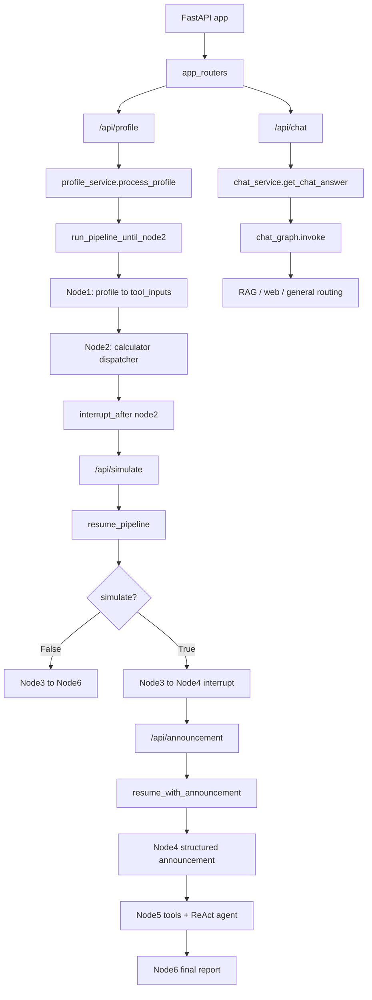

# 백엔드 엔진 - 툴 연결 흐름 보고서

기준 브랜치: `origin/final` (`2a7497a final`)

작성 목적: 최종 브랜치 기준으로 FastAPI 진입점부터 LangGraph 엔진, 각 Node, 계산/RAG/LLM 툴이 어떤 순서와 위치에서 연결되는지 정리한다.

## 1. 결론 요약

현재 백엔드의 엔진 - 툴 연결은 하나의 단일 방식이 아니라 두 종류로 나뉜다.

1. 자가진단/전략 파이프라인
   - API: `/api/profile`, `/api/simulate`, `/api/announcement`
   - 엔진: `Backend/src/pipeline.py`의 LangGraph `StateGraph`
   - 툴 연결 방식:
     - Node 1: 사용자 프로필을 계산기 툴 입력값(`tool_inputs`)으로 변환
     - Node 2: `dispatcher.py` 레지스트리를 통해 결정론적 계산기 툴 직접 실행
     - Node 4: LangGraph `interrupt` 후 공고문 자유 텍스트를 LLM structured output으로 정형화
     - Node 5: 일부 툴은 순서 고정 `invoke`, 일부 툴은 ReAct agent에 넘겨 LLM이 호출
     - Node 6: 최종 리포트 조립 또는 LLM 요약 생성

2. FAQ 챗봇 RAG 파이프라인
   - API: `/api/chat`
   - 엔진: `Backend/src/rag/chat_graph.py`의 별도 LangGraph
   - 툴 연결 방식:
     - ChromaDB 검색기(`retriever.py`)와 DuckDuckGo 웹 검색 툴을 조건부로 사용

핵심 약점은 Node 2와 Node 5의 툴 연결 방식이 서로 다르다는 점이다. Node 2는 레지스트리 기반 함수 호출이라 재현성이 높지만, Node 5는 고정 호출과 ReAct agent 호출이 섞여 있어 결과 흐름을 추적하려면 프롬프트와 agent 실행까지 함께 봐야 한다.

## 2. 전체 API 진입 흐름

근거 위치:

- 라우터 통합: `Backend/app/routers/app_routers.py:6-10`
- FastAPI 앱에 라우터 연결: `Backend/main.py:6`
- `/api/profile` 진입점: `Backend/app/routers/profile.py:8`
- `/api/simulate` 진입점: `Backend/app/routers/simulate_router.py:8`
- `/api/announcement` 진입점: `Backend/app/routers/announcement_router.py:8`
- `/api/chat` 진입점: `Backend/app/routers/chat_router.py:8`

## 3. 자가진단 파이프라인 구조

LangGraph 파이프라인은 `Backend/src/pipeline.py`에서 구성된다.

근거 위치:

- `StateGraph(PipelineState)` 생성: `Backend/src/pipeline.py:62`
- Node 등록: `Backend/src/pipeline.py:65-70`
- 기본 edge: `START -> node1 -> node2 -> node3`: `Backend/src/pipeline.py:72-74`
- Node 3 조건 분기: `Backend/src/pipeline.py:76`
- 상세 진단 흐름: `node4 -> node5 -> node6 -> END`: `Backend/src/pipeline.py:85-87`
- Node 2 이후 인터럽트: `Backend/src/pipeline.py:91`
- 최초 실행 함수: `Backend/src/pipeline.py:99`
- simulate 선택 후 재개: `Backend/src/pipeline.py:119`
- 공고문 입력 후 재개: `Backend/src/pipeline.py:143`

의미:

- `/api/profile` 요청은 Node 1과 Node 2까지만 실행하고 멈춘다.
- 이후 사용자가 상세 시뮬레이션 여부를 선택하면 `/api/simulate`이 같은 `session_id`로 graph state를 재개한다.
- 상세 시뮬레이션을 선택하면 Node 4에서 다시 멈추고, 공고문 텍스트를 `/api/announcement`로 받아 Node 5와 Node 6까지 실행한다.

## 4. API 서비스와 파이프라인 연결

### 4.1 프로필 입력

흐름:

`/api/profile` -> `process_profile()` -> `run_pipeline_until_node2()`

근거 위치:

- `profile_service.py`가 `run_pipeline_until_node2`를 import: `Backend/app/services/profile_service.py:2`
- `process_profile()` 정의: `Backend/app/services/profile_service.py:5`
- Pydantic 입력을 `model_dump()`로 dict 변환: `Backend/app/services/profile_service.py:10`
- 파이프라인 최초 실행 호출: `Backend/app/services/profile_service.py:11`

반환값:

- `session_id`
- `supply_rank`
- `recommended_supply`

반환 조립 위치: `Backend/src/pipeline.py:110-116`

### 4.2 상세 시뮬레이션 여부 선택

흐름:

`/api/simulate` -> `process_simulate()` -> `resume_pipeline()`

근거 위치:

- `simulate_service.py`가 `resume_pipeline` import: `Backend/app/services/simulate_service.py:1`
- `process_simulate()` 정의: `Backend/app/services/simulate_service.py:4`
- `resume_pipeline(session_id, simulate)` 호출: `Backend/app/services/simulate_service.py:10`
- graph state에 `wants_detailed_diagnosis` 업데이트: `Backend/src/pipeline.py:123-126`

분기:

- `simulate=True`: Node 4 인터럽트 대기 응답 반환
- `simulate=False`: Node 6까지 진행 후 간단 리포트 반환

근거 위치:

- Node 4 대기 상태 감지: `Backend/src/pipeline.py:133`
- 대기 응답 반환: `Backend/src/pipeline.py:134-138`
- 성공 응답 조립: `Backend/src/pipeline.py:140`

### 4.3 공고문 입력

흐름:

`/api/announcement` -> `process_announcement()` -> `resume_with_announcement()`

근거 위치:

- `announcement_service.py`가 `resume_with_announcement` import: `Backend/app/services/announcement_service.py:1`
- `process_announcement()` 정의: `Backend/app/services/announcement_service.py:4`
- `resume_with_announcement(session_id, announcement_text)` 호출: `Backend/app/services/announcement_service.py:9`
- `Command(resume=announcement_text)`로 Node 4 재개: `Backend/src/pipeline.py:147`

## 5. Node별 엔진 - 툴 연결

### 5.1 Node 1: 프로필 정규화와 툴 입력 생성

파일: `Backend/src/engine/node1.py`

역할:

- 입력 state에서 `profile`을 추출한다.
- 신청 가능성이 있는 특별공급 유형을 판정한다.
- Node 2 계산기 툴이 사용할 `tool_inputs`를 만든다.

근거 위치:

- `run_node1()` 정의: `Backend/src/engine/node1.py:39`
- `tool_inputs` 생성: `Backend/src/engine/node1.py:49`
- 일반공급 가점 계산 입력 추가: `Backend/src/engine/node1.py:60`
- Node 2로 넘길 state patch 반환: `Backend/src/engine/node1.py:64`
- 가능 특공 판정 함수: `Backend/src/engine/node1.py:84`
- 특공 계산 payload 생성: `Backend/src/engine/node1.py:134`
- 일반공급 가점 payload 생성: `Backend/src/engine/node1.py:179`

연결되는 다음 단계:

- Node 2는 이 `tool_inputs`를 그대로 받아 계산기 툴 dispatcher에 넘긴다.

### 5.2 Node 2: 계산기 툴 dispatcher 호출

파일: `Backend/src/engine/node2.py`

역할:

- Node 1이 만든 `available_supply_types`와 `tool_inputs`를 사용한다.
- `run_calculator_tools()`를 호출해 일반공급/특공 계산 툴을 실행한다.
- 계산 결과로 `supply_rank`, `recommended_supply`, `supply_analysis`를 만든다.

근거 위치:

- dispatcher import: `Backend/src/engine/node2.py:12`
- 특공 유형과 툴 이름 매핑: `Backend/src/engine/node2.py:17`
- `node2_recommend_supply()` 정의: `Backend/src/engine/node2.py:33`
- `_tool_results()`에서 `tool_inputs` 확인: `Backend/src/engine/node2.py:79`
- `run_calculator_tools()` 호출: `Backend/src/engine/node2.py:91`
- 특공 분석 item에서 툴 결과 조회: `Backend/src/engine/node2.py:104`
- 최종 순위 생성: `Backend/src/engine/node2.py:128`

주의:

- Node 2는 LangChain `@tool` agent 호출이 아니라 일반 Python 함수 레지스트리를 통한 직접 실행이다.
- 따라서 Node 2 결과는 LLM 판단보다 입력값과 계산 로직에 더 직접적으로 종속된다.

### 5.3 Node 2 계산기 dispatcher

파일: `Backend/src/engine/tools/calculator/dispatcher.py`

역할:

- Node 2가 실행할 계산기 툴 목록을 `NODE2_CALCULATOR_TOOLS`로 관리한다.
- 후보 공급 유형에 맞지 않는 특공 툴은 skip한다.
- 각 툴의 payload key와 runner를 분리한다.

근거 위치:

- 일반공급 점수 툴 import: `Backend/src/engine/tools/calculator/dispatcher.py:10`
- 특공 계산 툴 import: `Backend/src/engine/tools/calculator/dispatcher.py:13-15`
- 일반공급 runner: `Backend/src/engine/tools/calculator/dispatcher.py:57`
- 신혼부부 runner: `Backend/src/engine/tools/calculator/dispatcher.py:61`
- 다자녀 runner: `Backend/src/engine/tools/calculator/dispatcher.py:65`
- 생애최초 runner: `Backend/src/engine/tools/calculator/dispatcher.py:69`
- 툴 레지스트리: `Backend/src/engine/tools/calculator/dispatcher.py:72`
- dispatcher 실행 함수: `Backend/src/engine/tools/calculator/dispatcher.py:100`

실행되는 툴:

| dispatcher name | payload key | 실제 함수 |
|---|---|---|
| `calculate_housing_subscription_score` | `housing_subscription_score` | `calculate_housing_subscription_score_tool()` |
| `calculate_newlywed_special_supply` | `special_supply` | `calculate_newlywed_special_supply_tool()` |
| `calculate_multi_child_special_supply` | `special_supply` | `calculate_multi_child_special_supply_tool()` |
| `check_first_home_special_supply` | `special_supply` | `check_first_home_special_supply_tool()` |

실제 계산 로직 위치:

- 일반공급 가점 래퍼: `Backend/src/engine/tools/housing_subscription_score_tool.py:20`
- 일반공급 가점 본체: `Backend/src/engine/tools/calculator/housing_subscription_score.py:88`
- 신혼부부 특공 래퍼: `Backend/src/engine/tools/special_supply_tools.py:21`
- 다자녀 특공 래퍼: `Backend/src/engine/tools/special_supply_tools.py:27`
- 생애최초 특공 래퍼: `Backend/src/engine/tools/special_supply_tools.py:33`

### 5.4 Node 3: 상세 진단 여부 분기

파일: `Backend/src/engine/node3.py`

역할:

- `wants_detailed_diagnosis` 값을 state에 유지한다.
- `route_node3()`가 Node 4 또는 Node 6으로 분기한다.

근거 위치:

- `run_node3()` 정의: `Backend/src/engine/node3.py:13`
- `route_node3()` 정의: `Backend/src/engine/node3.py:22`
- 조건부 edge 연결 위치: `Backend/src/pipeline.py:76`

분기 결과:

- `"예"`, `"yes"`, `True`, `"true"`: Node 4
- 그 외: Node 6

### 5.5 Node 4: 공고문 입력 인터럽트와 구조화

파일: `Backend/src/engine/node4.py`

역할:

- LangGraph `interrupt()`로 사용자 공고문 입력을 기다린다.
- 입력된 자유 텍스트를 `ChatOpenAI.with_structured_output()`으로 `AnnouncementSchema`에 맞춰 정형화한다.

근거 위치:

- `AnnouncementSchema` 정의: `Backend/src/engine/node4.py:19`
- `run_node4()` 정의: `Backend/src/engine/node4.py:54`
- `interrupt()` 호출: `Backend/src/engine/node4.py:61`
- `ChatOpenAI(model="gpt-4o-mini")` 생성: `Backend/src/engine/node4.py:66`
- structured output 설정: `Backend/src/engine/node4.py:67`
- 자유 텍스트 invoke: `Backend/src/engine/node4.py:68`

생성 state:

- `announcement`
  - `region`
  - `is_regulated`
  - `supply_type`
  - `price`
  - `deposit`
  - `area`
  - `supply_count`

### 5.6 Node 5: 고정 툴 호출 + ReAct agent

파일: `Backend/src/engine/node5.py`

역할:

- Node 2 추천 결과와 Node 4 공고문 정보를 합쳐 상세 전략 분석을 생성한다.
- 재무/RAG 일부 툴은 순서 고정으로 직접 호출한다.
- 전략 비교, 당첨 경쟁력 지표, 청약 시점 분석은 ReAct agent에 툴로 넘긴다.

근거 위치:

- `create_react_agent` import: `Backend/src/engine/node5.py:18`
- `run_node5()` 정의: `Backend/src/engine/node5.py:64`
- 대출 가능 금액 툴 직접 invoke: `Backend/src/engine/node5.py:79`
- 실투자금 툴 직접 invoke: `Backend/src/engine/node5.py:87`
- 자금 리스크 툴 직접 invoke: `Backend/src/engine/node5.py:94`
- 지역 우선공급 RAG 툴 직접 invoke: `Backend/src/engine/node5.py:104`
- ReAct agent용 툴 목록: `Backend/src/engine/node5.py:116`
- ReAct agent 생성: `Backend/src/engine/node5.py:122`
- agent 실행: `Backend/src/engine/node5.py:231`

고정 호출 툴:

| 순서 | 툴 | 위치 |
|---|---|---|
| 1 | `calculate_loan_amount` | `Backend/src/engine/tools/financial.py:42` |
| 2 | `calculate_real_investment` | `Backend/src/engine/tools/financial.py:78` |
| 3 | `analyze_financial_risk` | `Backend/src/engine/tools/financial.py:108` |
| 4 | `check_regional_priority` | `Backend/src/engine/tools/rag_tools.py:115` |

ReAct agent에 전달되는 툴:

| 툴 | 위치 | 역할 |
|---|---|---|
| `compare_supply_strategy` | `Backend/src/engine/tools/strategy_tools.py:90` | Node 2 특공/일반공급 결과 비교 |
| `calculate_winning_probability` | `Backend/src/engine/tools/probability_tools.py:112` | 공급 세대수, 지역, 평형, 점수 기반 경쟁력 지표 |
| `analyze_subscription_timing` | `Backend/src/engine/tools/rag_tools.py:162` | 청약통장 가입기간/납입횟수와 1순위 요건 분석 |

주의:

- Node 5의 ReAct agent는 프롬프트 지시를 따라 툴을 호출한다. 따라서 디버깅할 때는 `node5.py`의 agent prompt까지 근거로 봐야 한다.
- `mock_tools`라는 변수명은 실제 mock이 아니라 agent에 넘기는 실제 `@tool` 목록이다. 이름만 보면 오해할 수 있다.

### 5.7 Node 6: 최종 리포트 생성

파일: `Backend/src/engine/node6.py`

역할:

- 상세 시뮬레이션 여부에 따라 간단 리포트 또는 상세 리포트를 생성한다.
- 간단 리포트는 Node 2 결과를 LLM으로 요약한다.
- 상세 리포트는 Node 5 결과와 공고문/재무 정보를 조립한다.

근거 위치:

- `run_node6()` 정의: `Backend/src/engine/node6.py:45`
- 간단 리포트 생성 함수: `Backend/src/engine/node6.py:62`
- 간단 리포트 LLM chain invoke: `Backend/src/engine/node6.py:79`
- 상세 리포트 생성 함수: `Backend/src/engine/node6.py:95`
- Node 5 agent 결과를 `strategy`에 반영: `Backend/src/engine/node6.py:119`

## 6. FAQ 챗봇 RAG 연결 흐름

챗봇은 자가진단 파이프라인과 별도의 graph를 사용한다.

흐름:

`/api/chat` -> `get_chat_answer()` -> `rag_app.invoke()` -> `chat_graph`

근거 위치:

- `build_chat_graph` import 및 graph 초기화: `Backend/app/services/chat_service.py:9-14`
- `get_chat_answer()` 정의: `Backend/app/services/chat_service.py:17`
- `rag_app.invoke()` 호출: `Backend/app/services/chat_service.py:41`
- 답변과 출처 반환: `Backend/app/services/chat_service.py:47-53`

`chat_graph.py` 내부 흐름:

- DuckDuckGo 웹 검색 툴 생성: `Backend/src/rag/chat_graph.py:35`
- RAG retrieve 노드: `Backend/src/rag/chat_graph.py:102`
- RAG 답변 생성 노드: `Backend/src/rag/chat_graph.py:162`
- 웹 검색 노드: `Backend/src/rag/chat_graph.py:192`
- 웹 검색 툴 invoke: `Backend/src/rag/chat_graph.py:201`
- graph 빌드: `Backend/src/rag/chat_graph.py:255`
- graph node 등록: `Backend/src/rag/chat_graph.py:259-264`
- 조건부 분기 edge: `Backend/src/rag/chat_graph.py:269`, `Backend/src/rag/chat_graph.py:279`
- MemorySaver 사용: `Backend/src/rag/chat_graph.py:294`

검색기 위치:

- 파일: `Backend/src/rag/retriever.py`
- ChromaDB persistent path: `Backend/src/rag/retriever.py`의 `CHROMA_PATH`
- 검색 대상 collection: `law_chunks`, `faq_chunks`, `manual_chunks`, `lh_guide_chunks`, `web_faq_chunks`, `guide_chunks`
- 주요 함수:
  - `route_collections()`
  - `search_all()`
  - `search_weighted()`
  - `search()`
  - `format_source()`

## 7. 툴 유형별 분류

| 구분 | 위치 | 호출 주체 | 호출 방식 | 특징 |
|---|---|---|---|---|
| Node 2 계산기 툴 | `Backend/src/engine/tools/calculator/dispatcher.py` | Node 2 | Python 함수 직접 호출 | 재현성 높음, 후보 특공 기반 skip |
| 일반공급 가점 툴 | `Backend/src/engine/tools/housing_subscription_score_tool.py` | dispatcher | 함수 wrapper | calculator 본체로 위임 |
| 특공 계산 툴 | `Backend/src/engine/tools/special_supply_tools.py` | dispatcher | 함수 wrapper | 신혼부부/다자녀/생애최초 |
| Node 5 재무 툴 | `Backend/src/engine/tools/financial.py` | Node 5 | LangChain `@tool.invoke` | 순서 고정 |
| Node 5 전략 툴 | `Backend/src/engine/tools/strategy_tools.py` | ReAct agent | agent tool call | LLM 프롬프트 의존 |
| Node 5 확률 툴 | `Backend/src/engine/tools/probability_tools.py` | ReAct agent | agent tool call | 참고용 경쟁력 지표 |
| Node 5 RAG 툴 | `Backend/src/engine/tools/rag_tools.py` | Node 5 / ReAct agent | 직접 invoke + agent tool call | retriever와 LLM chain 사용 |
| 챗봇 RAG 검색 | `Backend/src/rag/retriever.py` | chat_graph | 함수 호출 | ChromaDB 다중 collection 검색 |
| 챗봇 웹 검색 | `Backend/src/rag/chat_graph.py` | chat_graph | DuckDuckGo tool invoke | RAG 외부 보완 |

## 8. 응답 데이터 조립 위치

자가진단 최종 응답은 `Backend/src/pipeline.py`의 `_build_resume_response()`에서 API 친화적 형태로 조립된다.

근거 위치:

- Node 5 결과 묶음 생성: `Backend/src/pipeline.py:161-166`
- 최종 response dict 생성: `Backend/src/pipeline.py:168-178`

포함 필드:

- `status`
- `session_id`
- `report`
- `profile`
- `announcement`
- `available_supply_types`
- `supply_analysis`
- `supply_rank`
- `recommended_supply`
- `node5`
- `node6`

## 9. 검토 시 주의할 점

1. `final` 브랜치에는 `Backend/__pycache__` 파일들이 포함되어 있다.
   - 로직 분석에는 사용하지 않았다.
   - 실제 근거는 `.py` 파일만 기준으로 했다.

2. Node 2와 Node 5의 툴 호출 모델이 다르다.
   - Node 2: dispatcher가 결정론적으로 툴을 실행한다.
   - Node 5: 직접 `invoke`와 ReAct agent 호출이 혼재한다.
   - 따라서 “툴 연결”을 하나의 패턴으로 설명하면 부정확하다.

3. Node 4는 `interrupt_after=["node2"]`와 별개로 자체 `interrupt()`를 사용한다.
   - 첫 번째 중단점은 pipeline compile 옵션이다.
   - 두 번째 중단점은 Node 4 내부에서 발생한다.

4. `Backend/src/engine/tools/rag_tools.py`에는 `_rag_answer()` 안에서 `search(query)`를 호출한 뒤 곧바로 `_load_retriever().search(query)`로 다시 덮어쓰는 코드가 있다.
   - 동작에는 큰 문제가 없을 수 있지만, 첫 번째 `search(query)` 결과는 사용되지 않는다.
   - 근거 위치: `Backend/src/engine/tools/rag_tools.py:36-41`

5. Node 5의 `mock_tools` 변수명은 실제 구현 의도를 흐린다.
   - 내부 값은 `compare_supply_strategy`, `calculate_winning_probability`, `analyze_subscription_timing` 실제 툴이다.
   - 근거 위치: `Backend/src/engine/node5.py:116-122`

## 10. 한 줄 구조 정리

자가진단 백엔드는 FastAPI 서비스가 `pipeline.py`의 LangGraph를 세션 기반으로 실행/재개하고, Node 1이 툴 입력을 만들고, Node 2가 계산기 dispatcher로 공급 전략 후보를 산출하며, 상세 선택 시 Node 4가 공고문을 구조화하고 Node 5가 재무/RAG/전략 툴을 결합해 분석한 뒤 Node 6이 최종 리포트를 만든다.
