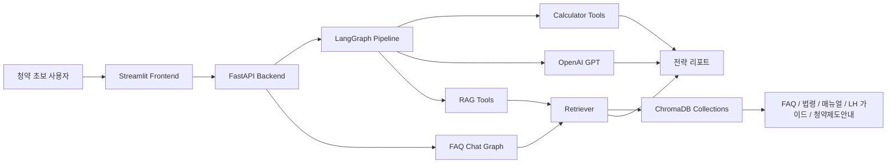
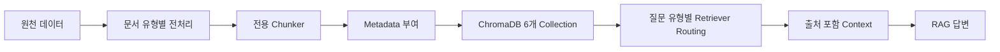
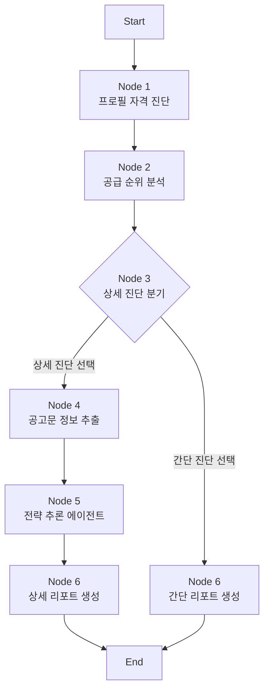

# 청약 전략 추천 RAG 시스템

> 아파트 분양과 청약이 처음인 사용자를 위해, 복잡한 청약 제도와 공급 유형을 쉽게 진단하고 개인별 청약 전략을 제안하는 RAG 기반 서비스입니다.

<p>
  
  
  
  
  
</p>

## 1. 팀 구성 및 역할

### 1.1 팀원별 담당 영역

| 팀원 | 이미지 | 역할 | 담당 영역 | 주요 산출물 |
|---|---|---|---|---|
| 준억 |  | 작성 필요 | 작성 필요 | 작성 필요 |
| 동윤 |  | 작성 필요 | 작성 필요 | 작성 필요 |
| 지훈 |  | 작성 필요 | 작성 필요 | 작성 필요 |
| 은진 |  | 작성 필요 | 작성 필요 | 작성 필요 |

### 1.2 본인 담당 범위

| 구분 | 내용 |
|---|---|
| 담당 기능 | 작성 필요 |
| 구현 범위 | 작성 필요 |
| 작성 산출물 | 작성 필요 |
| 문제 해결 기여 | 작성 필요 |

## 2. 프로젝트 개요

청약 제도는 무주택 여부, 혼인 기간, 자녀 수, 소득 기준, 청약통장 가입 기간, 지역 우선공급 등 여러 조건이 결합되어 있어 초보자가 스스로 판단하기 어렵습니다.

이 프로젝트는 **아파트 분양과 청약을 처음 접하는 사용자**를 주 타겟으로 삼고, 사용자의 기본 프로필을 기반으로 신청 가능성이 있는 공급 유형을 진단한 뒤 RAG와 LangGraph 파이프라인을 통해 개인별 전략 리포트를 생성합니다.

| 항목 | 내용 |
|---|---|
| 문제 상황 | 청약 초보자는 공식 문서의 용어, 조건, 계산 방식을 이해하기 어렵다. |
| 해결 방향 | 정량 계산은 코드로 고정하고, 제도 설명과 전략 문장은 RAG/LLM으로 보완한다. |
| 핵심 사용자 | 아파트 분양과 청약 신청을 처음 준비하는 사용자 |
| 최종 목표 | 사용자가 자신의 청약 가능성, 추천 공급 유형, 상세 전략을 한 화면에서 이해하도록 돕는다. |

## 3. 핵심 기능

| 기능 | 설명 |
|---|---|
| 청약 자격 진단 | 사용자 프로필을 기반으로 특별공급 가능 여부와 일반공급 가점을 계산합니다. |
| 공급 순위 분석 | 신혼부부, 다자녀, 생애최초, 일반공급 등 후보를 점수와 자격 기준으로 정렬합니다. |
| 공고문 기반 상세 진단 | 사용자가 입력한 관심 공고문 정보를 구조화해 자금, 지역, 경쟁력 분석에 사용합니다. |
| RAG 질의응답 | 청약 FAQ, 법령, 업무 매뉴얼, LH 가이드 등을 기반으로 근거 있는 답변을 제공합니다. |
| 전략 리포트 생성 | 자격, 점수, 자금 부담, 경쟁력, 다음 행동을 종합한 최종 리포트를 생성합니다. |

## 4. 전체 시스템 구조

서비스는 Streamlit 기반 프론트엔드, FastAPI 백엔드, LangGraph 전략 파이프라인, ChromaDB 기반 RAG 검색기, 규칙 기반 calculator 계층으로 구성됩니다.

핵심 설계 원칙은 **정답이 있는 계산은 코드로 처리하고, 설명과 전략처럼 맥락이 필요한 영역만 LLM에 맡기는 것**입니다.



## 5. RAG 데이터와 검색 전략

> 산출물 1번 요약: [01_RAG_데이터파이프라인_및_검색전략_통합보고서_v2.md](./01_RAG_데이터파이프라인_및_검색전략_통합보고서_v2.md)

청약 RAG는 단순히 많은 문서를 검색하는 구조가 아니라, 질문 성격에 맞는 문서 유형을 우선 검색하는 구조로 설계했습니다.

| Collection | 원천 데이터 | 역할 |
|---|---|---|
| `law_chunks` | 주택공급에 관한 규칙 | 법령 근거 검색 |
| `faq_chunks` | 2024 주택청약 FAQ | 일반 사용자 질문 대응 |
| `manual_chunks` | 주택공급 업무 매뉴얼 | 제도와 업무 절차 해설 |
| `lh_guide_chunks` | LH 분양가이드 | 최신 공공분양 기준 검색 |
| `web_faq_chunks` | 청약홈/마이홈 FAQ | 실무 FAQ 보강 |
| `guide_chunks` | 청약Home 청약제도안내 | 가점표, 제도 안내 검색 |



## 6. 품질 개선과 모델 적용성 평가

> 산출물 2번 요약: [청약_RAG_시스템_개선_리포트.md](./청약_RAG_시스템_개선_리포트.md)

품질 개선은 단순 UI 수정이 아니라, 사용자가 잘못된 추천이나 모순된 결론을 받지 않도록 계산 로직, payload, 프롬프트, 결과 표현을 함께 조정하는 방식으로 진행했습니다.

| 개선 항목 | 핵심 내용 |
|---|---|
| 입력 payload 정합성 | 프론트에서 수집한 세부 필드가 백엔드로 누락되지 않도록 수정 |
| 공급 추천 논리 | 자격 미달 항목이 1순위로 추천되는 모순 수정 |
| 점수 근거 노출 | 일반공급/특별공급 점수 산출 근거를 화면에 표시 |
| 경쟁력 표현 개선 | 실제 경쟁률 데이터가 없는 한계를 명시하고 보수적 표현 사용 |
| 자금 분석 보강 | 리스크 수준별 다음 행동 지침 추가 |

QLoRA는 최종 서비스 적용보다는 **로컬 생성 모델 대체 가능성 검토** 성격으로 남겼습니다. 가점 계산, 자격 판정, 공고문 구조화는 LLM 튜닝보다 Python 규칙 로직, Pydantic schema, Structured Output, 후처리 검증이 더 안정적이라고 판단했습니다.

## 7. LangGraph 기반 전략 파이프라인

> 산출물 3번 요약: [02_백엔드_엔진_툴_연결_흐름_보고서.md](./02_백엔드_엔진_툴_연결_흐름_보고서.md)

LangGraph 파이프라인은 6개 노드로 구성됩니다. Node 1~2는 결정론적 계산 중심이며, Node 4~6은 공고문 구조화, 전략 분석, 최종 리포트 생성을 담당합니다.



| Node | 역할 | LLM 사용 여부 |
|---|---|---|
| Node 1 | 사용자 프로필 정규화, 공급 유형 후보 판정 | 사용 안 함 |
| Node 2 | 계산기 dispatcher로 점수와 공급 순위 산출 | 사용 안 함 |
| Node 3 | 상세 진단 여부 라우팅 | 사용 안 함 |
| Node 4 | 공고문 자유 텍스트를 구조화 | 사용 |
| Node 5 | 재무, 지역, 경쟁력, 시점 분석 | 일부 사용 |
| Node 6 | 간단/상세 최종 리포트 생성 | 사용 |

## 8. 적용하지 않은 기술과 설계 판단

> 산출물 4번 요약: 상세 문서 추가 예정

이 프로젝트는 모든 기술을 많이 붙이는 방식보다, 청약 도메인에서 오답 위험을 줄이는 방향을 우선했습니다.

| 미적용 항목 | 판단 |
|---|---|
| Graph DB / Neo4j | 관계형 지식 그래프보다 ChromaDB collection 분리와 LangGraph 상태 흐름이 현재 범위에 적합하다고 판단 |
| KoNLPy 형태소 분석 | 청약 문서는 단어 단위보다 조항, Q&A, 표, 절 단위 문맥 보존이 더 중요하다고 판단 |
| BoW / TF-IDF / Word2Vec / FastText | dense embedding 기반 검색으로 대체 |
| LM-Eval harness | RAG 품질은 LLM Judge와 시나리오 기반 검증으로 우선 평가 |
| QLoRA 최종 적용 | 답변 스타일 학습 가능성은 확인 대상이나, 계산/판정/구조화에는 규칙 로직과 schema 검증이 우선 |

## 9. 기술 스택

| 영역 | 기술 |
|---|---|
| Frontend | Streamlit |
| Backend | FastAPI, Python, Pydantic |
| Workflow | LangGraph, LangChain |
| RAG | ChromaDB, OpenAI Embedding, LangChain Chroma |
| LLM | OpenAI GPT API |
| Data Processing | Markdown, PDF, HWP/HWPML, JSON |
| Search 보강 | DuckDuckGo Search |
| Experiment | QLoRA, LoRA, PEFT |
| Collaboration | GitHub, Markdown |

## 10. 실행 방법

### 10.1 환경 변수

```powershell
$env:OPENAI_API_KEY="your_openai_api_key"
$env:CHEONGYAK_API_MODE="auto"
$env:CHEONGYAK_API_BASE_URL="http://127.0.0.1:8000"
```

### 10.2 패키지 설치

```powershell
python -m pip install -r requirements.txt
```

### 10.3 Backend 실행

```powershell
cd backend
python -m uvicorn main:app --reload --host 127.0.0.1 --port 8000
```

### 10.4 Frontend 실행

```powershell
cd ..
python -m streamlit run frontend/streamlit_app.py
```

### 10.5 주요 API

| API | 역할 |
|---|---|
| `POST /api/profile` | 사용자 프로필 기반 1차 자격 진단 |
| `POST /api/simulate` | 상세 진단 진행 여부 선택 |
| `POST /api/announcement` | 공고문 정보 입력 후 상세 리포트 생성 |
| `POST /api/chat` | 청약 FAQ/RAG 챗봇 |

## 11. 폴더 구조

```text
SKN29-3rd-3team/
├── backend/
│   ├── app/                 # FastAPI router, service, schema
│   ├── data/                # 원천/가공 데이터
│   ├── docs/                # 청킹, API, 백엔드 설계 문서
│   └── src/
│       ├── engine/          # LangGraph node, tool, calculator
│       ├── preprocessing/   # 문서 유형별 chunker
│       └── rag/             # Retriever, chat graph
├── frontend/
│   ├── components/
│   ├── pages/
│   ├── services/
│   ├── state/
│   └── views/
├── docs/
│   └── assets/team/         # README 팀원 이미지
├── README.md
└── requirements.txt
```

## 12. 주요 화면 및 결과 예시

| 구분 | 내용 | 이미지 |
|---|---|---|
| 메인 화면 | 작성 필요 | 작성 필요 |
| 자격 진단 입력 | 작성 필요 | 작성 필요 |
| 공급 순위 결과 | 작성 필요 | 작성 필요 |
| 상세 전략 리포트 | 작성 필요 | 작성 필요 |
| RAG 챗봇 답변 | 작성 필요 | 작성 필요 |

## 13. 프로젝트 회고

### 준억

작성 필요

### 동윤

작성 필요

### 지훈

작성 필요

### 은진

작성 필요
