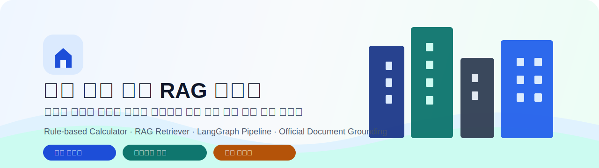
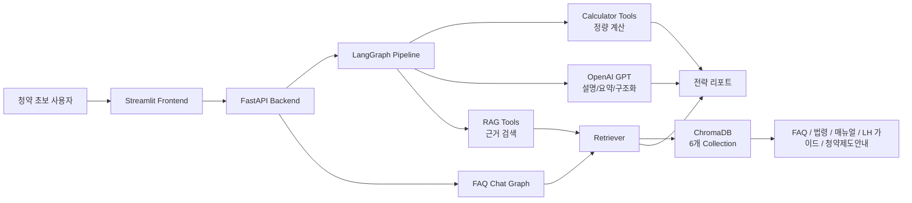
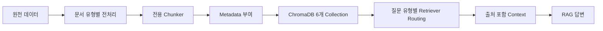
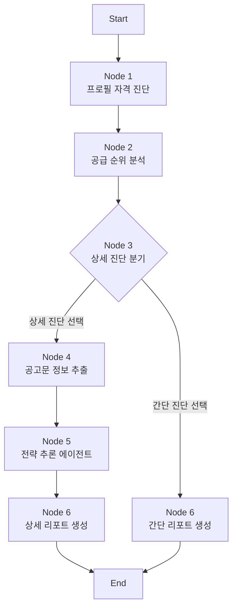

<div align="center">



<br/>
<br/>

### 아파트 분양과 청약이 처음인 사용자를 위한 개인 맞춤형 청약 전략 서비스

복잡한 청약 제도, 공급 유형, 가점 계산, 공고문 조건을 한 번에 이해하기 어렵다는 문제를 해결하기 위해  
**규칙 기반 계산**, **RAG 검색**, **LangGraph 전략 파이프라인**을 결합했습니다.

<br/>


</div>

<br/>

<table width="100%">
  <tr>
    <td width="25%" align="center">
      <br/>
      <b>Profile Diagnosis</b><br/>
      <sub>사용자 조건 기반 자격 진단</sub>
    </td>
    <td width="25%" align="center">
      <br/>
      <b>Supply Ranking</b><br/>
      <sub>특별공급/일반공급 우선순위 산출</sub>
    </td>
    <td width="25%" align="center">
      <br/>
      <b>RAG Grounding</b><br/>
      <sub>공식 문서 기반 근거 검색</sub>
    </td>
    <td width="25%" align="center">
      <br/>
      <b>Strategy Report</b><br/>
      <sub>공고문과 자금 조건을 반영한 전략 리포트</sub>
    </td>
  </tr>
</table>

<table width="100%">
  <tr>
    <td align="center" width="20%"><br/><code>#1D4ED8</code></td>
    <td align="center" width="20%"><br/><code>#0F766E</code></td>
    <td align="center" width="20%"><br/><code>#B45309</code></td>
    <td align="center" width="20%"><br/><code>#334155</code></td>
    <td align="center" width="20%"><br/><code>#F8FAFC</code></td>
  </tr>
</table>

---

## 목차

| 구분 | 내용 |
|---|---|
| 1 | [팀 구성 및 역할](#1-팀-구성-및-역할) |
| 2 | [프로젝트 개요](#2-프로젝트-개요) |
| 3 | [핵심 기능](#3-핵심-기능) |
| 4 | [전체 시스템 구조](#4-전체-시스템-구조) |
| 5 | [RAG 데이터와 검색 전략](#5-rag-데이터와-검색-전략) |
| 6 | [품질 개선과 모델 적용성 평가](#6-품질-개선과-모델-적용성-평가) |
| 7 | [LangGraph 기반 전략 파이프라인](#7-langgraph-기반-전략-파이프라인) |
| 8 | [적용하지 않은 기술과 설계 판단](#8-적용하지-않은-기술과-설계-판단) |
| 9 | [기술 스택](#9-기술-스택) |
| 10 | [실행 방법](#10-실행-방법) |
| 11 | [폴더 구조](#11-폴더-구조) |
| 12 | [주요 화면 및 결과 예시](#12-주요-화면-및-결과-예시) |
| 13 | [프로젝트 회고](#13-프로젝트-회고) |

---

## 1. 팀 구성 및 역할

### 1.1 팀원별 담당 영역

<table width="100%">
  <tr>
    <td align="center" width="25%">
      <br/>
      <h3>준억</h3>
      <b>역할 작성 필요</b><br/>
      <sub>담당 영역 작성 필요</sub>
    </td>
    <td align="center" width="25%">
      <br/>
      <h3>동윤</h3>
      <b>역할 작성 필요</b><br/>
      <sub>담당 영역 작성 필요</sub>
    </td>
    <td align="center" width="25%">
      <br/>
      <h3>지훈</h3>
      <b>역할 작성 필요</b><br/>
      <sub>담당 영역 작성 필요</sub>
    </td>
    <td align="center" width="25%">
      <br/>
      <h3>은진</h3>
      <b>역할 작성 필요</b><br/>
      <sub>담당 영역 작성 필요</sub>
    </td>
  </tr>
</table>

| 팀원 | 역할 | 담당 영역 | 주요 산출물 |
|---|---|---|---|
| 준억 | 작성 필요 | 작성 필요 | 작성 필요 |
| 동윤 | 작성 필요 | 작성 필요 | 작성 필요 |
| 지훈 | 작성 필요 | 작성 필요 | 작성 필요 |
| 은진 | 작성 필요 | 작성 필요 | 작성 필요 |

### 1.2 본인 담당 범위

| 구분 | 내용 |
|---|---|
| 담당 기능 | 작성 필요 |
| 구현 범위 | 작성 필요 |
| 작성 산출물 | 작성 필요 |
| 문제 해결 기여 | 작성 필요 |

---

## 2. 프로젝트 개요

> 청약 초보자는 공식 문서를 읽어도 내가 어떤 공급 유형에 유리한지, 어떤 조건을 충족하지 못했는지, 실제 공고에 넣어도 되는지 판단하기 어렵습니다.

이 서비스는 **아파트 분양과 청약을 처음 접하는 사용자**를 주 타겟으로 합니다. 사용자의 기본 프로필을 바탕으로 신청 가능성이 있는 공급 유형을 진단하고, 공고문 조건과 RAG 기반 제도 설명을 결합해 개인별 전략 리포트를 제공합니다.

<table width="100%">
  <tr>
    <td width="50%">
      <br/>
      <b>처음 청약을 준비하는 사용자</b><br/>
      <sub>복잡한 공급 유형과 가점 조건을 스스로 해석하기 어려운 사용자를 기준으로 설계했습니다.</sub>
    </td>
    <td width="50%">
      <br/>
      <b>정량 계산은 코드, 설명은 LLM</b><br/>
      <sub>자격과 점수처럼 정답이 있는 영역은 규칙 기반 계산으로 고정합니다.</sub>
    </td>
  </tr>
</table>

| 서비스 관점 | 설계 내용 |
|---|---|
| 사용자 | 아파트 분양과 청약 신청을 처음 준비하는 사람 |
| 문제 | 청약 용어, 공급 유형, 가점, 소득 기준, 지역 요건을 한 번에 이해하기 어렵다. |
| 해결 | 계산 가능한 영역은 코드로 고정하고, 설명과 전략은 RAG/LLM으로 보완한다. |
| 결과 | 신청 가능성, 추천 공급 유형, 점수 근거, 상세 전략을 한 화면에서 확인한다. |

<table>
  <tr>
    <td width="25%"><b>1. 프로필 입력</b><br/><sub>가구, 혼인, 자녀, 소득, 통장 정보 입력</sub></td>
    <td width="25%"><b>2. 자격 계산</b><br/><sub>규칙 기반 calculator로 점수와 후보 산출</sub></td>
    <td width="25%"><b>3. 공고문 반영</b><br/><sub>지역, 분양가, 평형, 공급 세대수 구조화</sub></td>
    <td width="25%"><b>4. 전략 리포트</b><br/><sub>자금, 경쟁력, 다음 행동 제안</sub></td>
  </tr>
</table>

---

## 3. 핵심 기능

<table width="100%">
  <tr>
    <td width="20%" align="center"><br/><b>신청 가능성</b></td>
    <td width="20%" align="center"><br/><b>가점/순위</b></td>
    <td width="20%" align="center"><br/><b>공식 문서</b></td>
    <td width="20%" align="center"><br/><b>실투자금</b></td>
    <td width="20%" align="center"><br/><b>최종 제안</b></td>
  </tr>
</table>

| 기능 | 사용자에게 보이는 가치 | 구현 방식 |
|---|---|---|
| 청약 자격 진단 | 내가 어떤 공급 유형을 검토할 수 있는지 확인 | 프로필 기반 규칙 판정 |
| 공급 순위 분석 | 신혼부부, 다자녀, 생애최초, 일반공급 중 우선순위 확인 | calculator dispatcher |
| 공고문 기반 상세 진단 | 관심 단지 조건을 반영한 현실적인 전략 확인 | structured output + Node 5 |
| RAG 질의응답 | 청약 제도 질문에 공식 문서 근거 기반 답변 제공 | ChromaDB + Retriever |
| 전략 리포트 생성 | 자격, 점수, 자금, 경쟁력, 다음 행동을 통합 확인 | LangGraph final report |

---

## 4. 전체 시스템 구조

서비스는 **Frontend**, **Backend API**, **LangGraph Pipeline**, **Calculator**, **RAG Retriever**, **Vector DB**로 나뉩니다. 신뢰도가 중요한 청약 도메인이므로, LLM이 모든 것을 판단하지 않도록 역할을 분리했습니다.

<table width="100%">
  <tr>
    <td align="center"></td>
    <td align="center"></td>
    <td align="center"></td>
    <td align="center"></td>
    <td align="center"></td>
  </tr>
</table>



| 판단 영역 | 담당 계층 | 이유 |
|---|---|---|
| 가점 계산, 자격 판정 | Python calculator | 정답이 있는 영역이므로 재현성과 검증 가능성이 중요 |
| 공고문 정보 추출 | GPT structured output | 자유 텍스트를 schema에 맞춰 정형화해야 함 |
| 제도 근거 검색 | RAG Retriever | 공식 문서 기반 답변과 출처 추적 필요 |
| 전략 설명과 리포트 문장 | LLM | 사용자 친화적인 설명과 종합 판단 필요 |

---

## 5. RAG 데이터와 검색 전략

> 산출물 1번 요약: [01_RAG_데이터파이프라인_및_검색전략_통합보고서_v2.md](./01_RAG_데이터파이프라인_및_검색전략_통합보고서_v2.md)

청약 RAG는 많이 검색하는 구조가 아니라, **질문 성격에 맞는 문서 유형을 우선 검색하는 구조**입니다. 법령, FAQ, 업무 매뉴얼, LH 가이드처럼 문서 성격이 다르기 때문에 collection을 분리하고 metadata로 출처를 추적합니다.

| Collection | 원천 데이터 | 주요 역할 | 신뢰 포인트 |
|---|---|---|---|
| `law_chunks` | 주택공급에 관한 규칙 | 법령 근거 검색 | 조/항/호 계층 보존 |
| `faq_chunks` | 2024 주택청약 FAQ | 일반 사용자 질문 대응 | Q&A 단위 보존 |
| `manual_chunks` | 주택공급 업무 매뉴얼 | 제도와 업무 절차 해설 | 장/절/소제목 구조 보존 |
| `lh_guide_chunks` | LH 분양가이드 | 최신 공공분양 기준 검색 | 공급 유형과 표 정보 반영 |
| `web_faq_chunks` | 청약홈/마이홈 FAQ | 실무 FAQ 보강 | 웹 FAQ category 보존 |
| `guide_chunks` | 청약Home 청약제도안내 | 가점표, 제도 안내 검색 | 표 정보를 자연어화 |



---

## 6. 품질 개선과 모델 적용성 평가

> 산출물 2번 요약: [청약_RAG_시스템_개선_리포트.md](./청약_RAG_시스템_개선_리포트.md)

품질 개선은 UI 표현만의 문제가 아니라, 사용자가 **잘못된 추천**, **모순된 결론**, **근거 없는 확신**을 받지 않도록 계산 로직과 표현 방식을 함께 조정하는 과정이었습니다.

| 개선 전 위험 | 개선 방향 | 결과 |
|---|---|---|
| 프론트 입력 일부가 백엔드 payload에서 누락 | detail 필드와 schema 정합성 보강 | 신혼부부/일반공급 계산 누락 완화 |
| 자격 미달 항목이 추천 상단에 노출 | 확정 가능 후보와 미확정 후보 분리 | 추천 결과의 논리 일관성 강화 |
| 점수만 보이고 근거가 부족 | score breakdown 노출 | 사용자가 점수 산출 이유를 확인 가능 |
| 경쟁력 표현이 단정적 | 참고용 경쟁력 지표로 표현 조정 | 실제 경쟁률 데이터 부재 한계 명시 |
| 자금 진단이 추상적 | action items 추가 | 다음 행동으로 이어지는 리포트 구성 |

QLoRA는 최종 서비스 적용보다 **로컬 생성 모델 대체 가능성 검토** 성격으로 남겼습니다. 가점 계산, 자격 판정, 공고문 구조화는 LLM 튜닝보다 Python 규칙 로직, Pydantic schema, structured output, 후처리 검증이 더 안정적이라고 판단했습니다.

---

## 7. LangGraph 기반 전략 파이프라인

> 산출물 3번 요약: [02_백엔드_엔진_툴_연결_흐름_보고서.md](./02_백엔드_엔진_툴_연결_흐름_보고서.md)

LangGraph 파이프라인은 6개 노드로 구성됩니다. Node 1~2는 결정론적 계산, Node 4~6은 공고문 구조화와 전략 리포트 생성을 담당합니다.



| Node | 역할 | LLM 사용 여부 | 신뢰 설계 |
|---|---|---|---|
| Node 1 | 사용자 프로필 정규화, 공급 유형 후보 판정 | 사용 안 함 | 입력값을 계산 가능한 payload로 변환 |
| Node 2 | 계산기 dispatcher로 점수와 공급 순위 산출 | 사용 안 함 | 재현 가능한 규칙 기반 계산 |
| Node 3 | 상세 진단 여부 라우팅 | 사용 안 함 | 조건 분기만 수행 |
| Node 4 | 공고문 자유 텍스트를 구조화 | 사용 | schema 기반 structured output |
| Node 5 | 재무, 지역, 경쟁력, 시점 분석 | 일부 사용 | 정량 툴과 RAG 툴 결합 |
| Node 6 | 간단/상세 최종 리포트 생성 | 사용 | 사용자 친화적 결과 조립 |

---

## 8. 적용하지 않은 기술과 설계 판단

> 산출물 4번 요약: 상세 문서 추가 예정

이 프로젝트는 많은 기술을 붙이는 방식보다, 청약 도메인에서 오답 위험을 줄이는 방향을 우선했습니다. 특히 청약 초보자가 보는 결과이기 때문에, 설명보다 먼저 계산과 근거의 안정성을 확보하는 것이 중요했습니다.

| 미적용 항목 | 판단 |
|---|---|
| Graph DB / Neo4j | 관계형 지식 그래프보다 ChromaDB collection 분리와 LangGraph 상태 흐름이 현재 범위에 적합하다고 판단 |
| KoNLPy 형태소 분석 | 청약 문서는 단어 단위보다 조항, Q&A, 표, 절 단위 문맥 보존이 더 중요하다고 판단 |
| BoW / TF-IDF / Word2Vec / FastText | dense embedding 기반 검색으로 대체 |
| LM-Eval harness | RAG 품질은 LLM Judge와 시나리오 기반 검증으로 우선 평가 |
| QLoRA 최종 적용 | 답변 스타일 학습 가능성은 연구 후보이나, 계산/판정/구조화에는 규칙 로직과 schema 검증이 우선 |

---

## 9. 기술 스택

<table>
  <tr>
    <td width="25%"><b>Frontend</b><br/><sub>Streamlit</sub></td>
    <td width="25%"><b>Backend</b><br/><sub>FastAPI, Python, Pydantic</sub></td>
    <td width="25%"><b>Workflow</b><br/><sub>LangGraph, LangChain</sub></td>
    <td width="25%"><b>RAG</b><br/><sub>ChromaDB, OpenAI Embedding</sub></td>
  </tr>
  <tr>
    <td><b>LLM</b><br/><sub>OpenAI GPT API</sub></td>
    <td><b>Data</b><br/><sub>Markdown, PDF, HWP/HWPML, JSON</sub></td>
    <td><b>Search</b><br/><sub>DuckDuckGo Search</sub></td>
    <td><b>Experiment</b><br/><sub>QLoRA, LoRA, PEFT</sub></td>
  </tr>
</table>

---

## 10. 실행 방법

### 10.1 환경 변수

```powershell
$env:OPENAI_API_KEY="your_openai_api_key"
$env:CHEONGYAK_API_MODE="auto"
$env:CHEONGYAK_API_BASE_URL="http://127.0.0.1:8000"
```

### 10.2 패키지 설치

```powershell
python -m pip install -r requirements.txt
```

### 10.3 Backend 실행

```powershell
cd backend
python -m uvicorn main:app --reload --host 127.0.0.1 --port 8000
```

### 10.4 Frontend 실행

```powershell
cd ..
python -m streamlit run frontend/streamlit_app.py
```

### 10.5 주요 API

| API | 역할 |
|---|---|
| `POST /api/profile` | 사용자 프로필 기반 1차 자격 진단 |
| `POST /api/simulate` | 상세 진단 진행 여부 선택 |
| `POST /api/announcement` | 공고문 정보 입력 후 상세 리포트 생성 |
| `POST /api/chat` | 청약 FAQ/RAG 챗봇 |

---

## 11. 폴더 구조

```text
SKN29-3rd-3team/
├── backend/
│   ├── app/                 # FastAPI router, service, schema
│   ├── data/                # 원천/가공 데이터
│   ├── docs/                # 청킹, API, 백엔드 설계 문서
│   └── src/
│       ├── engine/          # LangGraph node, tool, calculator
│       ├── preprocessing/   # 문서 유형별 chunker
│       └── rag/             # Retriever, chat graph
├── frontend/
│   ├── components/
│   ├── pages/
│   ├── services/
│   ├── state/
│   └── views/
├── docs/
│   └── assets/team/         # README 팀원 이미지
├── README.md
└── requirements.txt
```

---

## 12. 주요 화면 및 결과 예시

| 구분 | 내용 | 이미지 |
|---|---|---|
| 메인 화면 | 작성 필요 | 작성 필요 |
| 자격 진단 입력 | 작성 필요 | 작성 필요 |
| 공급 순위 결과 | 작성 필요 | 작성 필요 |
| 상세 전략 리포트 | 작성 필요 | 작성 필요 |
| RAG 챗봇 답변 | 작성 필요 | 작성 필요 |

---

## 13. 프로젝트 회고

| 팀원 | 회고 |
|---|---|
| 준억 | 작성 필요 |
| 동윤 | 작성 필요 |
| 지훈 | 작성 필요 |
| 은진 | 작성 필요 |
