<div align="center">


<br/>
<br/>

### 아파트 분양과 청약이 처음인 사용자를 위한 개인 맞춤형 청약 전략 서비스

복잡한 청약 제도, 공급 유형, 가점 계산, 공고문 조건을 한 번에 이해하기 어렵다는 문제를 해결하기 위해  
**규칙 기반 계산**, **RAG 검색**, **LangGraph 전략 파이프라인**을 결합했습니다.

<br/>


</div>

<br/>

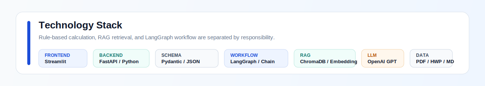

<br/>

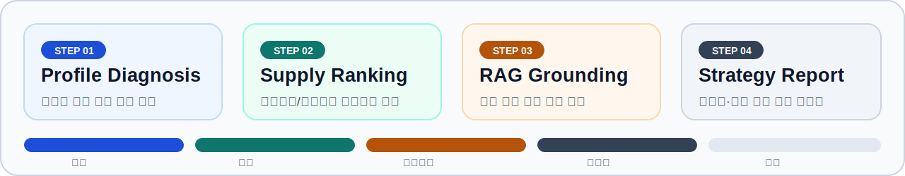

---

## 목차

| 구분 | 내용 |
|---|---|
| 1 | [팀 구성 및 역할](#1-팀-구성-및-역할) |
| 2 | [프로젝트 개요](#2-프로젝트-개요) |
| 3 | [핵심 기능](#3-핵심-기능) |
| 4 | [전체 시스템 구조](#4-전체-시스템-구조) |
| 5 | [RAG 데이터와 검색 전략](#5-rag-데이터와-검색-전략) |
| 6 | [품질 개선과 모델 적용성 평가](#6-품질-개선과-모델-적용성-평가) |
| 7 | [LangGraph 기반 전략 파이프라인](#7-langgraph-기반-전략-파이프라인) |
| 8 | [적용하지 않은 기술과 설계 판단](#8-적용하지-않은-기술과-설계-판단) |
| 9 | [기술 스택](#9-기술-스택) |
| 10 | [실행 방법](#10-실행-방법) |
| 11 | [폴더 구조](#11-폴더-구조) |
| 12 | [주요 화면 및 결과 예시](#12-주요-화면-및-결과-예시) |
| 13 | [프로젝트 회고](#13-프로젝트-회고) |

## 1. 팀 구성 및 역할

### 1.1 팀원별 담당 영역

<table width="100%">
  <tr>
    <td align="center" width="25%">
      <br/>
      <h3>준억</h3>
      <b>Backend</b><br/>
      <sub>API 연동·LangChain 파이프라인 연계</sub>
    </td>
    <td align="center" width="25%">
      <br/>
      <h3>동윤</h3>
      <b>Backend</b><br/>
      <sub>FAQ 챗봇 · 성능 평가</sub>
    </td>
    <td align="center" width="25%">
      <br/>
      <h3>지훈</h3>
      <b>Full-stack · Planning</b><br/>
      <sub>RAG · LangGraph 전략 파이프라인</sub>
    </td>
    <td align="center" width="25%">
      <br/>
      <h3>은진</h3>
      <b>Frontend · Planning</b><br/>
      <sub>LangChain 연동 · API 연동 UI</sub>
    </td>
  </tr>
</table>

| 팀원 | 역할 | 담당 영역 |
|---|---|---|
| 준억 | Backend | FastAPI API 연동, LangChain 툴 호출 흐름, 백엔드 계산/전략 파이프라인 연계 |
| 동윤 | Backend | FAQ 챗봇, RAG 응답 품질 확인, 성능 평가 및 품질 고도화 |
| 지훈 | Full-stack / Planning | RAG 검색 전략, LangGraph 진단 파이프라인, 전체 구조 기획 및 산출물 정리 |
| 은진 | Frontend / Planning | 자가진단·결과 화면 UI, API 응답 연동, LangChain 기반 응답 흐름 화면 반영 |


---

## 2. 프로젝트 개요

> 청약 초보자는 공식 문서를 읽어도 내가 어떤 공급 유형에 유리한지, 어떤 조건을 충족하지 못했는지, 실제 공고에 넣어도 되는지 판단하기 어렵습니다.

이 서비스는 **아파트 분양과 청약을 처음 접하는 사용자**를 주 타겟으로 합니다. <br>
사용자의 기본 프로필을 바탕으로 신청 가능성이 있는 공급 유형을 진단하고, 공고문 조건과 RAG 기반 제도 설명을 결합해 개인별 전략 리포트를 제공합니다.

<table width="100%">
  <tr>
    <td width="50%">
      <br/>
      <b>처음 청약을 준비하는 사용자</b><br/>
      <sub>복잡한 공급 유형과 가점 조건을 스스로 해석하기 어려운 사용자를 기준으로 설계했습니다.</sub>
    </td>
    <td width="50%">
      <br/>
      <b>정량 계산은 코드, 설명은 LLM</b><br/>
      <sub>자격과 점수처럼 정답이 있는 영역은 규칙 기반 계산으로 고정합니다.</sub>
    </td>
  </tr>
</table>

| 서비스 관점 | 설계 내용 |
|---|---|
| 사용자 | 아파트 분양과 청약 신청을 처음 준비하는 사람 |
| 문제 | 청약 용어, 공급 유형, 가점, 소득 기준, 지역 요건을 한 번에 이해하기 어렵다. |
| 해결 | 계산 가능한 영역은 코드로 고정하고, 설명과 전략은 RAG/LLM으로 보완한다. |
| 결과 | 신청 가능성, 추천 공급 유형, 점수 근거, 상세 전략을 한 화면에서 확인한다. |

<table>
  <tr>
    <td width="25%"><b>1. 프로필 입력</b><br/><sub>가구, 혼인, 자녀, 소득, 통장 정보 입력</sub></td>
    <td width="25%"><b>2. 자격 계산</b><br/><sub>규칙 기반 calculator로 점수와 후보 산출</sub></td>
    <td width="25%"><b>3. 공고문 반영</b><br/><sub>지역, 분양가, 평형, 공급 세대수 구조화</sub></td>
    <td width="25%"><b>4. 전략 리포트</b><br/><sub>자금, 경쟁력, 다음 행동 제안</sub></td>
  </tr>
</table>

---

## 3. 핵심 기능

<table width="100%">
  <tr>
    <td width="20%" align="center"><br/><b>신청 가능성</b></td>
    <td width="20%" align="center"><br/><b>가점/순위</b></td>
    <td width="20%" align="center"><br/><b>공식 문서</b></td>
    <td width="20%" align="center"><br/><b>실투자금</b></td>
    <td width="20%" align="center"><br/><b>최종 제안</b></td>
  </tr>
</table>

| 기능 | 사용자에게 보이는 가치 | 구현 방식 |
|---|---|---|
| 청약 자격 진단 | 내가 어떤 공급 유형을 검토할 수 있는지 확인 | 프로필 기반 규칙 판정 |
| 공급 순위 분석 | 신혼부부, 다자녀, 생애최초, 일반공급 중 우선순위 확인 | calculator dispatcher |
| 공고문 기반 상세 진단 | 관심 단지 조건을 반영한 현실적인 전략 확인 | structured output + Node 5 |
| RAG 질의응답 | 청약 제도 질문에 공식 문서 근거 기반 답변 제공 | ChromaDB + Retriever |
| 전략 리포트 생성 | 자격, 점수, 자금, 경쟁력, 다음 행동을 통합 확인 | LangGraph final report |

---

## 4. 전체 시스템 구조

서비스는 **Frontend**, **Backend API**, **LangGraph Pipeline**, **Calculator**, **RAG Retriever**, **Vector DB**로 나뉩니다.<br>
신뢰도가 중요한 청약 도메인이므로, LLM이 모든 것을 판단하지 않도록 역할을 분리했습니다.

<table width="100%">
  <tr>
    <td align="center"></td>
    <td align="center"></td>
    <td align="center"></td>
    <td align="center"></td>
    <td align="center"></td>
  </tr>
</table>

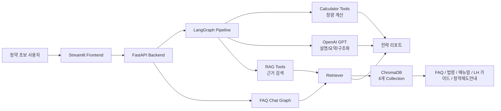

| 판단 영역 | 담당 계층 | 이유 |
|---|---|---|
| 가점 계산, 자격 판정 | Python calculator | 정답이 있는 영역이므로 재현성과 검증 가능성이 중요 |
| 공고문 정보 추출 | GPT structured output | 자유 텍스트를 schema에 맞춰 정형화해야 함 |
| 제도 근거 검색 | RAG Retriever | 공식 문서 기반 답변과 출처 추적 필요 |
| 전략 설명과 리포트 문장 | LLM | 사용자 친화적인 설명과 종합 판단 필요 |

---

## 5. RAG 데이터와 검색 전략

> 상세 산출물: [RAG 데이터 파이프라인 및 검색 전략](./docs/reports/01_RAG_데이터파이프라인_및_검색전략_통합보고서.md)

청약 RAG는 많이 검색하는 구조가 아니라, **질문 성격에 맞는 문서 유형을 우선 검색하는 구조**입니다.<br>
법령, FAQ, 업무 매뉴얼, LH 가이드처럼 문서 성격이 다르기 때문에 collection을 분리하고 metadata로 출처를 추적합니다.

청약 도메인은 일반 FAQ 검색보다 오류 위험이 큽니다. 사용자는 단순 설명뿐 아니라 자격, 소득, 가점, 전매제한, 거주의무처럼 **조건과 숫자가 결합된 답변**을 요구하기 때문에 문서 구조 보존과 출처 추적이 중요합니다.

| Collection | 원천 데이터 | 주요 역할 | 신뢰 포인트 |
|---|---|---|---|
| `law_chunks` | 주택공급에 관한 규칙 | 법령 근거 검색 | 조/항/호 계층 보존 |
| `faq_chunks` | 2024 주택청약 FAQ | 일반 사용자 질문 대응 | Q&A 단위 보존 |
| `manual_chunks` | 주택공급 업무 매뉴얼 | 제도와 업무 절차 해설 | 장/절/소제목 구조 보존 |
| `lh_guide_chunks` | LH 분양가이드 | 최신 공공분양 기준 검색 | 공급 유형과 표 정보 반영 |
| `web_faq_chunks` | 청약홈/마이홈 FAQ | 실무 FAQ 보강 | 웹 FAQ category 보존 |
| `guide_chunks` | 청약Home 청약제도안내 | 가점표, 제도 안내 검색 | 표 정보를 자연어화 |

| 설계 이슈 | 위험 | 대응 |
|---|---|---|
| 문서 유형 다양성 | 법령, FAQ, 매뉴얼, LH 가이드의 구조가 다름 | 문서 유형별 전용 청커 적용 |
| 최신성 차이 | 2017 매뉴얼과 2026 LH 가이드가 함께 검색될 수 있음 | `source_year`, `source`, collection 분리 |
| 숫자 조건 | 소득, 자산, 가점 기준이 잘못 검색될 수 있음 | 표 구조 보존 또는 자연어 변환 후 청킹 |
| 근거 추적 | 답변은 맞아도 출처가 없으면 신뢰도 저하 | metadata 기반 출처 라벨 생성 |

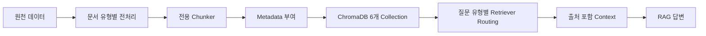

---

## 6. 품질 개선과 모델 적용성 평가

> 상세 산출물: [성능 평가 및 품질 고도화](./docs/reports/02_성능평가_품질고도화_통합보고서.md)

품질 개선의 핵심은 모델을 더 크게 만드는 것이 아니라, **검색 근거를 점검하고, 전략 판단의 모순을 줄이며, 사용자가 결과를 이해할 수 있는 화면으로 재구성한 것**입니다.

| 고도화 축 | 핵심 내용 |
|---|---|
| 검색 품질 | Recall@k와 LLM Judge로 검색 문서와 답변 근거성을 분리 평가 |
| 판단 품질 | 추천 공급유형, 경쟁력, 자금 리스크, 가점 근거의 모순을 줄임 |
| 사용자 이해도 | 결과를 카드, 표, 요약, 상세 근거로 나누어 초보자도 해석 가능하게 구성 |
| 모델 적용성 | QLoRA는 연구 후보로 남기고 GPT + RAG + Structured Output을 기본 경로로 판단 |

| 평가/개선 항목 | 반영 내용 |
|---|---|
| Recall@k | 14개 대표 질문에 대해 기대 collection과 필수 키워드 검색 여부 확인 |
| LLM Judge | Faithfulness 평균 9.8, Answer Relevance 평균 9.4로 기본 신뢰도 확인 |
| QLoRA 실험 | Qwen2.5-7B 기준 313개 데이터에서 ROUGE-1/ROUGE-L/BLEU 일부 개선 확인 |
| 전략 개선 | 자격 미달 항목이 추천 상위에 노출되지 않도록 확정 후보와 미확정 후보 분리 |
| UX 개선 | 추천 Top 3, 점수 근거, 자금 리스크, 개발자 payload 분리 등 결과 화면 개선 |

QLoRA는 최종 서비스 적용보다 **로컬 생성 모델 대체 가능성 검토** 성격으로 남겼습니다. <br>
청약 가점 계산과 자격 판정은 Python 규칙 로직이 더 안정적이며, 공고문 구조화는 GPT 기반 Structured Output과 Pydantic schema 검증이 더 직접적입니다.

---

## 7. LangGraph 기반 전략 파이프라인

> 상세 산출물: [LangGraph 파이프라인 아키텍처](./docs/reports/03_LangGraph_파이프라인_아키텍처_리포트.md)

LangGraph 파이프라인은 6개 노드, 8개의 LangChain 툴, 8개의 calculator 하위 모듈을 중심으로 구성됩니다. <br>
핵심 설계 철학은 **점수와 자격 판정처럼 정답이 있는 영역은 코드와 데이터 테이블로 고정하고, 전략 설명과 톤처럼 정답이 하나로 고정되지 않는 영역만 LLM에 맡기는 것**입니다.

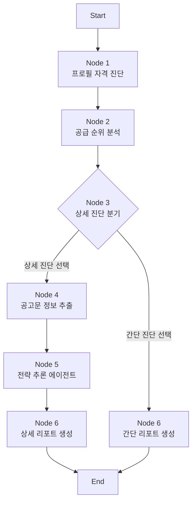

| Node | 역할 | LLM 사용 여부 | 신뢰 설계 |
|---|---|---|---|
| Node 1 | 사용자 프로필 정규화, 공급 유형 후보 판정 | 사용 안 함 | 입력값을 계산 가능한 payload로 변환 |
| Node 2 | 계산기 dispatcher로 점수와 공급 순위 산출 | 사용 안 함 | 재현 가능한 규칙 기반 계산 |
| Node 3 | 상세 진단 여부 라우팅 | 사용 안 함 | 조건 분기만 수행 |
| Node 4 | 공고문 자유 텍스트를 구조화 | 사용 | schema 기반 structured output |
| Node 5 | 재무, 지역, 경쟁력, 시점 분석 | 일부 사용 | 정량 툴과 RAG 툴 결합 |
| Node 6 | 간단/상세 최종 리포트 생성 | 사용 | 사용자 친화적 결과 조립 |

| 설계 포인트 | 내용 |
|---|---|
| 비용과 속도 분리 | 모든 사용자가 상세 시뮬레이션을 원하는 것은 아니므로 Node 1~2 결과만으로도 간단 리포트 제공 |
| interrupt 위치 제한 | 공고문 정보처럼 외부 입력이 필요한 Node 4에서만 그래프 일시정지 |
| State/API 응답 분리 | `supply_analysis`는 내부 전달용, `supply_rank`는 프론트 표시용으로 분리 |
| Hybrid ReAct | 대출액, 실투자금, 자금 리스크, 지역 우선공급은 고정 실행하고 전략 비교 일부만 Agent에 위임 |
| Unknown 처리 | 정보 부족과 자격 미달을 구분해 `가능성 있음 / 추가 확인 필요 / 가능성 낮음`으로 관리 |

Node 5는 계산 순서가 중요한 재무/지역 판단을 코드로 고정 실행하고, 전략 비교와 청약 시점 해석처럼 자연어 종합이 필요한 부분에만 제한적으로 ReAct Agent를 사용합니다. <br>
이미 계산된 수치는 프롬프트에 명시해 LLM이 임의로 재계산하거나 다른 값으로 바꾸지 않도록 방어적으로 설계했습니다.

---

## 8. 적용하지 않은 기술과 설계 판단

> 상세 산출물: [미적용 항목 및 설계 의도](<./docs/reports/04_미적용 항목 및 설계의도.md>)

이 프로젝트는 최신 기술을 많이 붙이는 것보다, 청약 도메인의 특성에 맞게 **안정적이고 설명 가능하며 비용 효율적인 구조**를 선택하는 방향으로 설계했습니다.

| 미적용 항목 | 배제 이유 | 대체 설계 |
|---|---|---|
| Graph DB / GraphRAG | 청약은 관계망 탐색보다 조건 판정과 수치 비교가 핵심 | ChromaDB 다중 컬렉션 + 쿼리 라우팅 + Python 규칙 계산 |
| 완전 자율형 Agent Loop | 자격 판정과 가점 계산을 Agent에게 맡기면 결과 변동 위험이 큼 | LangGraph 상태기계 + 제한적 ReAct Agent |
| 실시간 데이터 수집 자동화 | 공공 API 지연, 원문 정보 부족, 자동 크롤링 검증 부담 | Offline Golden Dataset + 사용자 주도형 On-Demand Parsing |
| 전체 공고 상시 수집 | 유휴 데이터 과다, 저장/색인 비용 증가 | 관심 공고문만 Node 4에서 구조화 |
| 경쟁률 실시간 예측 모델 | 과거 경쟁률 데이터 부족 | 휴리스틱 참고 지표, 향후 통계 DB 연동 |

향후 확장은 ChromaDB에서 pgvector로 이전, 공고문 PDF/HWP 업로드와 OCR, Daily Batch 수집, 관리자 검증 대시보드, 경쟁률/당첨가점 통계 DB 연동 순서로 단계적으로 검토할 수 있습니다.

---

## 9. 기술 스택

주요 기술 스택은 상단 소개 영역의 이미지에 요약했습니다. 본문에서는 각 기술군이 맡는 역할만 간단히 정리합니다.

| 영역 | 주요 기술 | 역할 |
|---|---|---|
| 화면 | Streamlit | 자가진단 입력, 결과 리포트, FAQ 챗봇 UI 제공 |
| API/규칙 계산 | FastAPI, Python, Pydantic | 사용자 입력 검증, 청약 자격/가점 계산, API 응답 구조화 |
| 전략 파이프라인/RAG | LangGraph, LangChain, ChromaDB, OpenAI | 검색 기반 근거 확보, 조건 분기, 전략 리포트 생성 |
| 실험 | QLoRA, LoRA, PEFT | GPT API 의존도 완화를 위한 장기 대체 가능성 검토 |

---

## 10. 실행 방법

### 10.1 가상환경 생성

Python은 **3.10.x 사용을 권장**합니다. `venv`는 Python 버전을 새로 정하는 도구가 아니라, 현재 실행한 Python 버전을 그대로 사용합니다. 따라서 `python` 명령이 Python 3.13을 가리키는 상태에서 `python -m venv .venv`를 실행하면 `.venv`도 3.13로 만들어져 NumPy/ChromaDB 계열 의존성이 깨질 수 있습니다.

이미 Python 3.13으로 `.venv`를 만들었다면 먼저 삭제하고 다시 생성합니다.

```powershell
deactivate
Remove-Item -Recurse -Force .venv -ErrorAction SilentlyContinue
```

Windows Python Launcher가 있으면 Python 3.10을 명시해서 생성합니다.

```powershell
py -3.10 -m venv .venv
.\.venv\Scripts\Activate.ps1
python --version
python -m pip install --upgrade pip
```

`python --version` 결과가 `Python 3.10.x`인지 확인한 뒤 다음 단계로 진행합니다.

`py -3.10`이 인식되지 않으면 Python Launcher가 설치되어 있지 않은 상태입니다. 이 경우 Python 3.10을 설치하면서 **Add Python to PATH**를 선택하거나, Conda 환경을 사용하는 방식으로 진행합니다.

```powershell
conda create -n cheongyak-rag python=3.10 -y
conda activate cheongyak-rag
python --version
python -m pip install --upgrade pip
```

Conda 명령도 PATH에 없다면, 설치된 Python 3.10 실행 파일의 전체 경로로 venv를 만들 수 있습니다.

```powershell
& "C:\Users\Playdata\AppData\Local\miniconda3\envs\new_01\python.exe" -m venv .venv
.\.venv\Scripts\Activate.ps1
python --version
python -m pip install --upgrade pip
```

PowerShell에서 스크립트 실행이 막히면 현재 터미널에서만 정책을 완화한 뒤 다시 활성화합니다.

```powershell
Set-ExecutionPolicy -Scope Process -ExecutionPolicy Bypass
.\.venv\Scripts\Activate.ps1
```

### 10.2 패키지 설치

```powershell
python -m pip install -r requirements.txt
```

### 10.3 환경 변수

Backend와 Frontend를 실행하는 터미널에 동일하게 설정합니다. `.env` 파일을 사용하는 경우에는 같은 값을 저장해도 됩니다.

```powershell
$env:OPENAI_API_KEY="your_openai_api_key"
$env:CHEONGYAK_API_MODE="http"
$env:CHEONGYAK_API_BASE_URL="http://127.0.0.1:8000"
```

### 10.4 RAG DB 준비

FAQ 챗봇에서 내부 문서 기반 RAG 검색을 사용하려면 ChromaDB collection이 먼저 생성되어 있어야 합니다. 이미 `backend/src/preprocessing/chroma_db`에 6개 collection이 준비되어 있다면 이 단계는 생략할 수 있습니다.

```powershell
python backend/src/preprocessing/build_all.py
```

이 단계는 OpenAI Embedding API를 사용하므로 유효한 `OPENAI_API_KEY`가 필요합니다. ChromaDB collection이 없으면 챗봇은 실행되더라도 내부 RAG 검색 대신 웹 검색 폴백으로 응답할 수 있습니다.

### 10.5 Backend 실행

첫 번째 PowerShell에서 실행합니다.

```powershell
# venv를 사용한 경우
.\.venv\Scripts\Activate.ps1

# Conda를 사용한 경우
# conda activate cheongyak-rag

python -m uvicorn main:app --app-dir backend --reload --host 127.0.0.1 --port 8000
```

### 10.6 Frontend 실행

두 번째 PowerShell에서 실행합니다.

```powershell
# venv를 사용한 경우
.\.venv\Scripts\Activate.ps1

# Conda를 사용한 경우
# conda activate cheongyak-rag

python -m streamlit run frontend/streamlit_app.py
```

### 10.7 주요 API

| API | 역할 |
|---|---|
| `POST /api/profile` | 사용자 프로필 기반 1차 자격 진단 |
| `POST /api/simulate` | 상세 진단 진행 여부 선택 |
| `POST /api/announcement` | 공고문 정보 입력 후 상세 리포트 생성 |
| `POST /api/chat` | 청약 FAQ/RAG 챗봇 |

---

## 11. 폴더 구조

```text
SKN29-3rd-3team/
├── backend/
│   ├── app/
│   │   ├── routers/         # FastAPI endpoint
│   │   ├── schemas/         # request/response schema
│   │   └── services/        # API service layer
│   ├── data/                # 원천 문서, FAQ JSON, 구조화 JSON
│   ├── src/
│   │   ├── engine/          # LangGraph node, tool, calculator
│   │   ├── preprocessing/   # 문서 유형별 chunker, ChromaDB build
│   │   └── rag/             # Retriever, chat graph
│   └── main.py              # FastAPI app entrypoint
├── frontend/
│   ├── components/          # 공통 UI 컴포넌트
│   ├── config/              # API mode/base URL 설정
│   ├── domain/              # 화면 상수, 옵션 정의
│   ├── pages/               # Streamlit page entry
│   ├── services/            # API client, payload 변환, mock API
│   ├── state/               # 자가진단 세션 상태
│   ├── views/               # 자가진단/결과/챗봇 화면 구성
│   └── streamlit_app.py     # Streamlit app entrypoint
├── docs/
│   ├── reports/             # 최종 제출 산출물 4종
│   └── assets/
│       ├── readme/          # README 상단 소개 이미지
│       ├── reports/         # 산출물 공통 시각화 SVG
│       ├── screenshots/     # 서비스 화면 예시
│       └── team/            # README 팀원 이미지
├── README.md
└── requirements.txt
```

---

## 12. 주요 화면 및 결과 예시

**진입 → 입력 → 공고문 반영 → 추천 결과 → 상세 분석 → RAG 챗봇** 순서로 확인할 수 있게 구성했습니다.

<table width="100%">
  <tr>
    <td width="50%" valign="top">
      <b>서비스 첫 화면</b><br/>
      <sub>청약 초보자가 바로 진단을 시작할 수 있는 진입 화면</sub><br/><br/>
      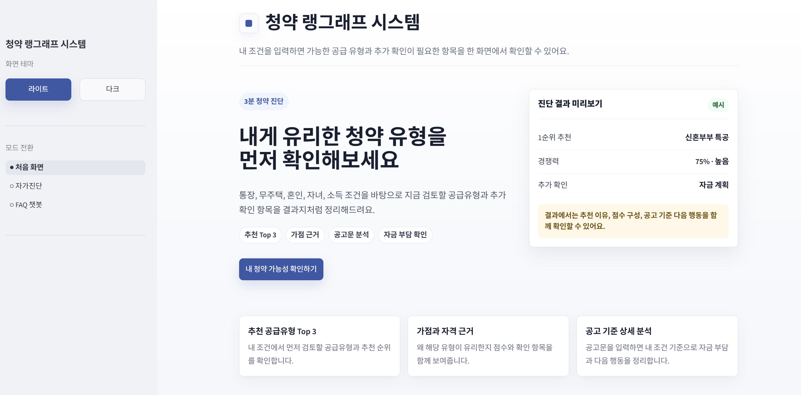
    </td>
    <td width="50%" valign="top">
      <b>자가진단 입력 시작</b><br/>
      <sub>청약통장 정보를 시작으로 단계형 입력 플로우 제공</sub><br/><br/>
      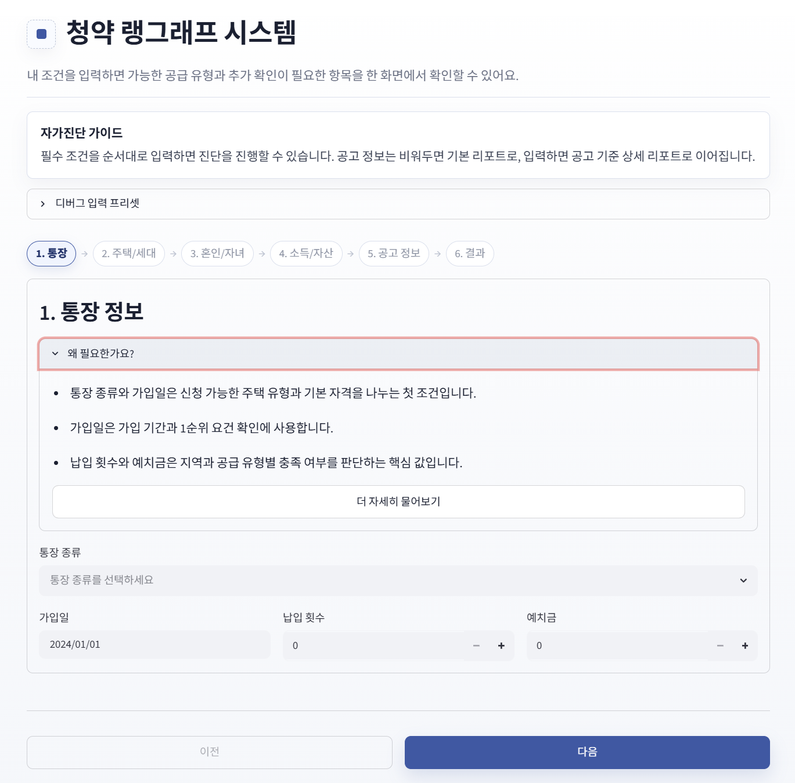
    </td>
  </tr>
  <tr>
    <td width="50%" valign="top">
      <b>공고문 기반 상세 입력</b><br/>
      <sub>관심 공고문 정보를 입력하면 공고 기준 상세 리포트로 확장</sub><br/><br/>
      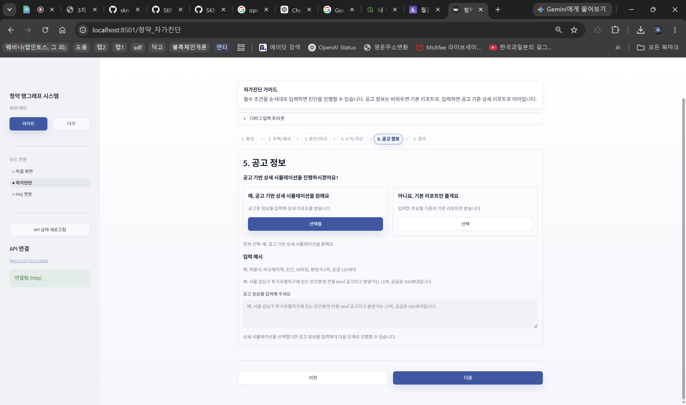
    </td>
    <td width="50%" valign="top">
      <b>추천 결과 요약</b><br/>
      <sub>추천 Top 3, 공고 기준 반영 여부, 다음 행동을 한 화면에 제시</sub><br/><br/>
      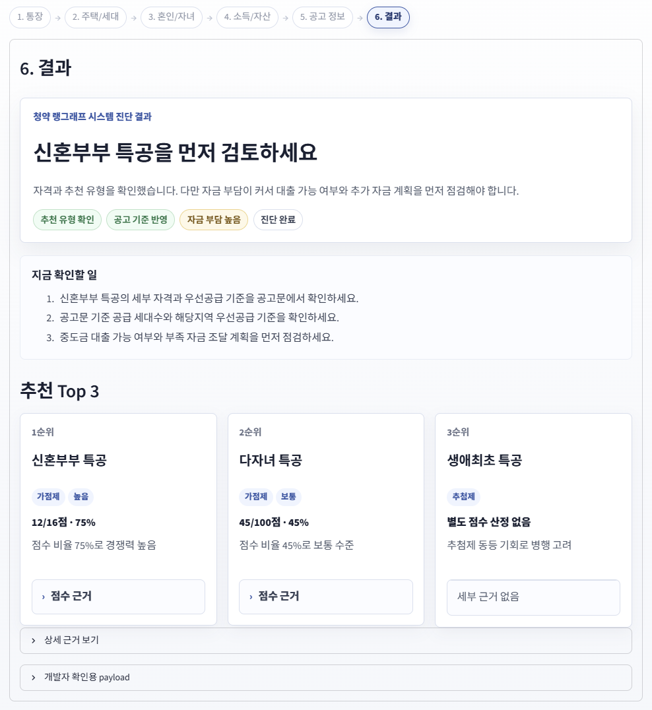
    </td>
  </tr>
  <tr>
    <td width="50%" valign="top">
      <b>공고 및 재무 분석</b><br/>
      <sub>지역, 공급유형, 면적, 분양가, 대출 가능액, 실투자금, 자금 리스크 표시</sub><br/><br/>
      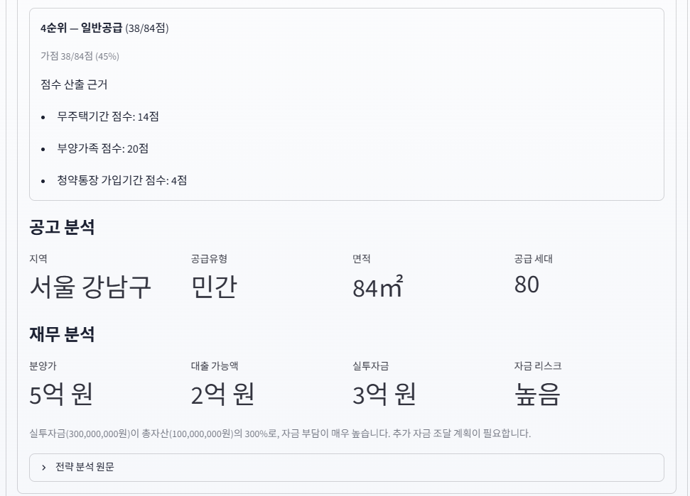
    </td>
    <td width="50%" valign="top">
      <b>FAQ 챗봇과 참고 자료</b><br/>
      <sub>RAG 답변과 함께 참고한 공식 문서 출처를 칩 형태로 표시</sub><br/><br/>
      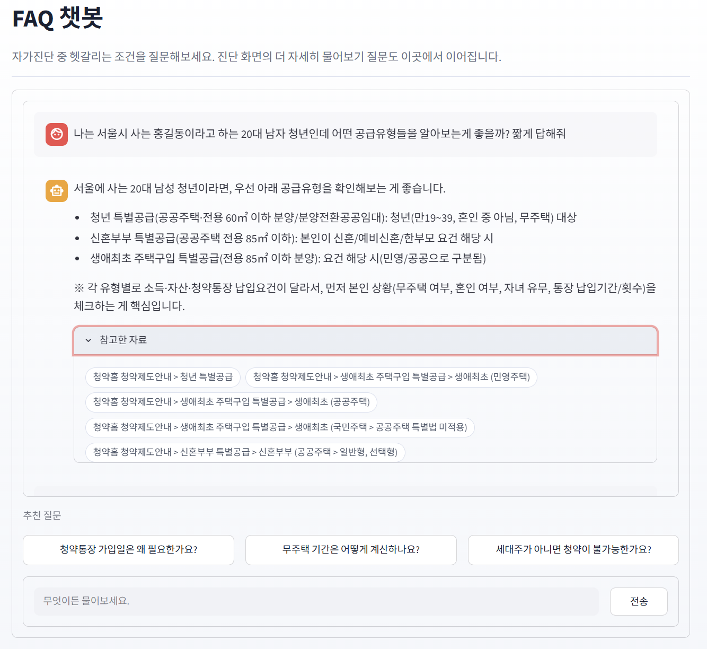
    </td>
  </tr>
</table>

---

## 13. 프로젝트 회고

### 👤 준억

> FastAPI 기반 API와 LangChain Tool 호출 흐름을 연동해, 사용자 입력이 백엔드 계산 및 전략 추천 파이프라인을 거쳐 결과로 반환되는 구조를 구현했습니다.
>
> 청약 가점, 자격 조건, 자금 부담 분석처럼 정확성이 중요한 영역은 규칙 기반 로직으로 처리하고, LLM은 공고문 구조화와 전략 설명을 담당하도록 역할을 분리했습니다. 이를 통해 LLM을 모든 판단에 사용하는 것보다, 계산 로직과 조합했을 때 더 안정적인 서비스를 만들 수 있다는 점을 배웠습니다.
>
> 또한 백엔드에서 생성된 결과 payload를 프론트엔드에서 이해하기 쉬운 정보 구조로 가공하면서, 기능 구현뿐 아니라 사용자 경험을 고려한 데이터 설계가 중요하다는 점을 느꼈습니다. 향후에는 개발 초기 단계에서 API 응답 스키마와 결과 출력 기준을 더 명확히 정의해, 프론트엔드·백엔드 간 협업 효율과 서비스 완성도를 높이고 싶습니다.

---

### 👤 동윤

> FastAPI를 통해 프론트-백엔드 간 데이터 정합성을 맞추고, Langgraph 기반 RAG 아키텍처의 전체적인 워크플로우 제어와 LLM 환각(Hallucination) 방지 대책을 깊이 있게 고민해 볼 수 있었던 프로젝트였습니다.

---

### 👤 지훈

> 이번 프로젝트에서 팀원들과 함께 LangGraph를 활용한 복잡한 AI 에이전트 워크플로우를 기획했습니다.
>
> LLM의 판단 흐름과 데이터가 백엔드 시스템 내에서 어떻게 제어되고 순환하는지 전반적인 아키텍처를 깊이 있게 이해할 수 있었으며, 초기 구상했던 에이전트 파이프라인의 흐름을 무너뜨리지 않고 팀과 함께 최종 완성까지 구현해 내며 보람을 느꼈습니다.
>
> 또한 AI 프로젝트 특성상 불확실성이 높았기에, 팀원 간의 싱크를 맞추고 방향성을 조율하는 리더십의 중요성을 체감했습니다. 프론트엔드와 백엔드/AI 개발자 사이의 기술/생각의 간극을 메우기 위해 명확한 요구사항 정의와 데이터 흐름도를 제시하며 팀을 한 방향으로 가게 하는 것이 중요하다고 느꼈습니다.

---

### 👤 은진

> 기획자의 역할과 무게를 체감할 수 있는 프로젝트였습니다.
>
> 프론트와 백엔드를 연결하는 과정에서 명확한 지시와 방향성을 제대로 짚어주지 않으면 팀의 작업 효율에 큰 영향을 미친다는 것을 느꼈습니다. 특히 기획 단계에서 요구사항과 데이터 흐름이 구체적으로 정의되지 않으면 개발 과정에서 불필요한 수정과 커뮤니케이션 비용이 발생할 수 있다는 점을 배울 수 있었습니다.
>
> 여러 시행착오가 있었지만 결과적으로는 API와 LangChain에 대한 이해를 한층 높일 수 있는 좋은 경험이었습니다. 단순히 기능을 구현하는 것을 넘어 각 컴포넌트가 어떤 역할을 수행하고 어떻게 연결되는지를 직접 고민해보며 전체 시스템을 바라보는 시야를 넓힐 수 있었습니다.
>
> 또한 프로젝트를 진행하면서 기술적인 이해만큼이나 팀원 간의 공통된 목표와 방향을 공유하는 것이 중요하다는 점을 느꼈습니다. 좋은 기획은 문서를 작성하는 것에서 끝나는 것이 아니라, 팀원 모두가 같은 그림을 볼 수 있도록 만드는 과정이라는 것을 배울 수 있었습니다.
>
> 앞으로의 프로젝트에서 기획을 담당하게 된다면 더욱 명확한 지시와 방향에 대한 이해를 충분히 한 후 진행하고, 개발자들이 혼선 없이 작업할 수 있도록 요구사항과 데이터 흐름을 구체적으로 설계하는 데 더 많은 노력을 기울일 것 같습니다.
