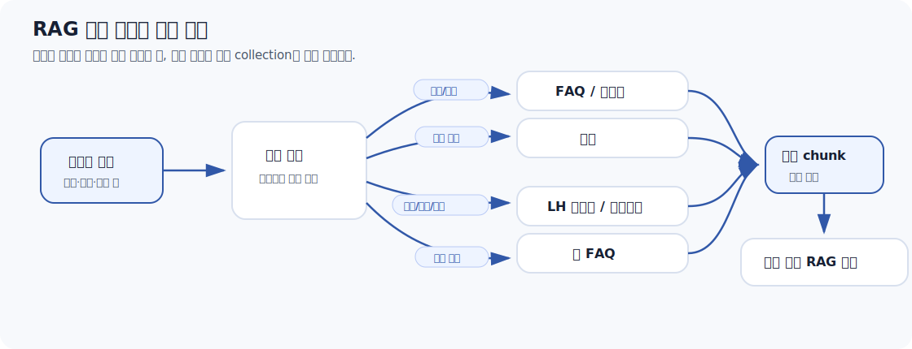
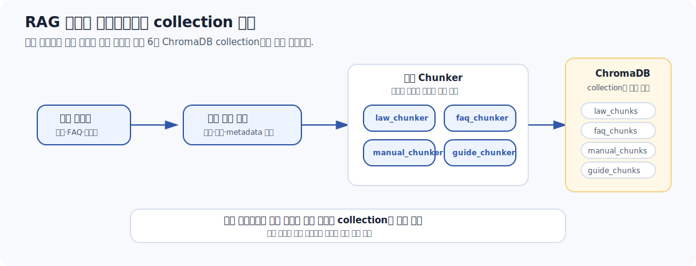
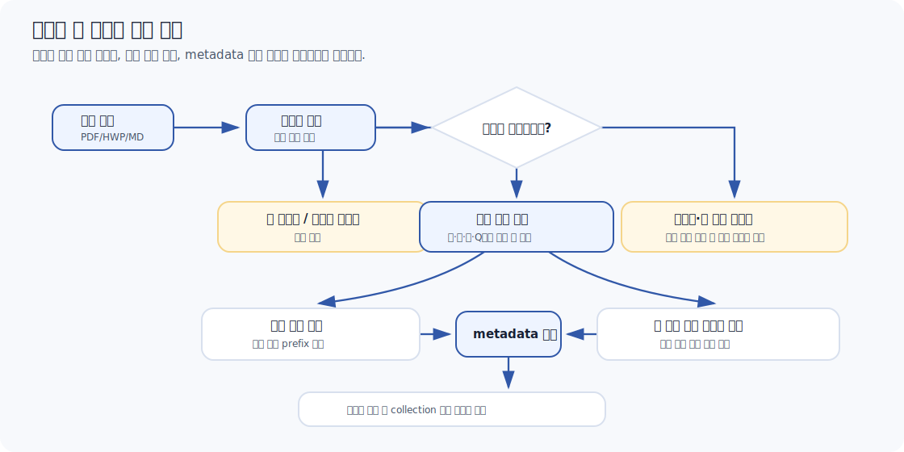
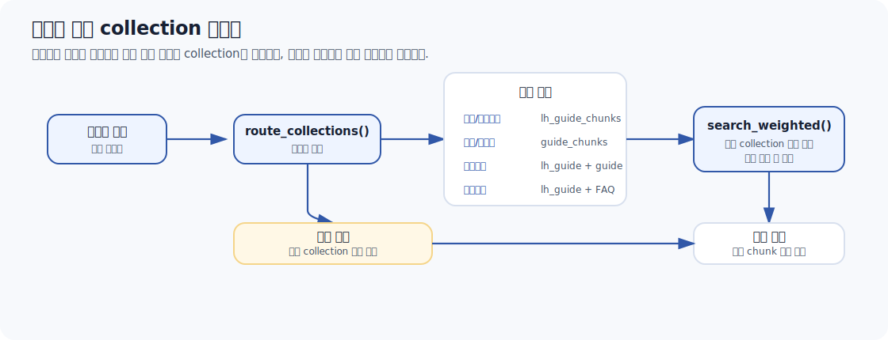

# RAG 데이터 파이프라인 및 검색 전략 통합보고서

## 1. 문서 목적

이 문서는 청약 전략 시스템의 RAG 품질이 어떻게 만들어지는지 하나의 흐름으로 설명한다. 

범위는 **원천 데이터 수집, 전처리, 문서 유형별 청킹, 메타데이터 설계, ChromaDB 적재, Retriever 검색 전략** 까지다.

> 어떤 데이터를 왜 수집했고, 문서 구조를 어떻게 보존했으며, Retriever가 질문 의도에 맞는 근거를 어떻게 찾는가?

---

## 2. 청약 RAG의 핵심 문제

청약 도메인은 일반 FAQ 검색보다 오류 위험이 크다. 

사용자는 단순 설명뿐 아니라 **자격, 소득, 가점, 전매제한, 거주의무처럼 조건과 숫자가 결합된 답변**을 요구한다. 

따라서 RAG 파이프라인은 "많이 검색하는 구조"가 아니라 **"질문 의도에 맞는 문서 유형을 우선 찾는 구조"** 여야 한다.

| 문제 | 구체적 위험 | 설계 대응 |
|---|---|---|
| 문서 유형이 다양함 | 법령, FAQ, 업무매뉴얼, LH 가이드, Markdown 안내 문서의 구조가 서로 다름 | 문서 유형별 전용 청커 적용 |
| 최신성 차이가 큼 | 2017 매뉴얼과 2026 LH 가이드가 동시에 검색될 수 있음 | `source_year`, `source`, collection 분리 |
| 숫자 조건이 많음 | 소득 기준, 자산 기준, 가점 계산 오류 가능 | 표 구조 보존 또는 자연어 변환 후 청킹 |
| 근거 추적이 필요함 | 답변은 맞아도 출처가 없으면 신뢰도 낮음 | metadata 기반 출처 라벨 생성 |
| 유사 내용이 반복됨 | FAQ, 매뉴얼, 웹 FAQ에 같은 주제가 중복됨 | 질문 유형별 collection 라우팅 |



---

## 3. 원천 데이터 구성과 역할

현재 RAG 구축 스크립트는 6개 ChromaDB collection을 생성한다. 

각 collection은 단순 파일 묶음이 아니라 서로 다른 질문 유형을 담당한다.

| Collection | 원천 데이터 | 형식 | 시스템 내 역할 | 주요 질문 |
|---|---|---|---|---|
| `law_chunks` | 주택공급에 관한 규칙 | HWP/HWPML | 법적 근거 | "신혼부부 특별공급 조항은?" |
| `faq_chunks` | 2024 주택청약 FAQ | PDF | 일반 사용자 질문 대응 | "무주택세대구성원이 뭐야?" |
| `manual_chunks` | 주택공급 업무 매뉴얼 | PDF | 제도/업무 해설 | "업무상 공급 절차는?" |
| `lh_guide_chunks` | LH 분양가이드 4종 | PDF | 최신 LH 공공분양 기준 | "전매제한 기간은?", "소득기준은?" |
| `web_faq_chunks` | 청약홈/마이홈 FAQ | JSON | 웹 기반 실무 FAQ | "청약통장 가입 관련 FAQ는?" |
| `guide_chunks` | 청약Home 청약제도안내 | Markdown | 청약 제도 안내/표 기반 정보 | "가점제 배점 기준은?" |

최신 ChromaDB 확인 기준 collection별 청크 수와 역할은 다음과 같다.

| Collection | 청크 수 | 청킹 단위 | 주요 metadata | 담당 질문 유형 |
|---|---:|---|---|---|
| `law_chunks` | 163개 | 조/항/호/목 | `law`, `article`, `paragraph` | 법령 근거 |
| `faq_chunks` | 480개 | Q&A | `q_number`, `chapter`, `section` | 일반 FAQ |
| `manual_chunks` | 144개 | 절/소제목/Q&A | `part`, `section`, `q_number` | 업무 해설 |
| `lh_guide_chunks` | 18개 | 문서/섹션/공급유형/표 | `page`, `supply_type`, `section_title` | LH 최신 기준 |
| `web_faq_chunks` | 120개 | Q&A | `category`, `subcategory`, `ntt_id` | 실무 FAQ |
| `guide_chunks` | 76개 | heading/문단 | `Header_1`, `Header_2`, `Header_3` | 제도/가점/표 정보 |

전체 RAG 데이터 파이프라인은 다음 순서로 동작한다.



---

## 4. 전처리 및 정합성 점검 기준

전처리의 목적은 텍스트를 깨끗하게 만드는 것에 그치지 않고 **RAG 검색에서 의미 단위가 깨지지 않도록 문서 구조를 보존**하는 것이 핵심이다.

| 점검 항목 | 적용 기준 | 적용 예시 | 현재 보완 포인트 |
|---|---|---|---|
| 불필요 페이지 제거 | 표지, 목차, 파트 구분 디자인 페이지 제외 | 업무 매뉴얼 p1, p7, p111 제외 | 제외 페이지 로그 보관 필요 |
| 헤더/푸터 제거 | 반복 날짜, URL, 브레드크럼, 페이지 번호 제거 | LH 가이드 캡처 날짜/URL 제거 | 최종 전처리 샘플 첨부 가능 |
| 구조 보존 | 장/절/조/항/Q번호/표 제목 유지 | 법령 조항 prefix, 매뉴얼 장절 prefix | collection별 샘플 chunk 필요 |
| 중복 대응 | 기준 연도와 출처를 metadata에 저장 | 2017 매뉴얼 vs 2024 FAQ vs 2026 LH | 최신성 우선순위 명시 필요 |
| 결측 대응 | 빈 본문, 디자인 전용 페이지 제외 | 이미지 전용 파트 구분 페이지 제거 | 자동 검증 로그 추가 가능 |
| 숫자 정보 보존 | 표를 자연어 문장 또는 의미 단위로 변환 | 소득기준 표, 가점표 | 변환 전후 예시 관리 필요 |

전처리 판단의 기준은 다음과 같다.



---

### 5.1 법령 청킹

법령은 글자 수로 자르면 안 된다. 조문은 장, 조, 항, 호, 목의 계층이 의미를 만든다. 

따라서 `law_chunks`는 계층 구조를 metadata에 남기고, 하위 단위 청크에는 상위 문맥을 prefix로 포함한다.

| 청크 단위 | 포함 문맥 | 이유 |
|---|---|---|
| 조 | 조 번호 + 조 제목 + 본문 | 조 전체가 짧을 때 가장 완결적 |
| 항 | 조 번호 + 조 제목 + 항 본문 | 항 단위 규정 검색 |
| 호/목 | 조 번호 + 조 제목 + 항 도입문 + 호/목 | 단독 반환 시 의미 단절 방지 |

예시 chunk:

```text
제41조(신혼부부 특별공급)
③ 신혼부부 특별공급의 입주자 선정 기준은 ...
```

### 5.2 FAQ 청킹

FAQ는 질문과 답변을 분리하지 않는다. 질문만 저장하면 답변 근거가 사라지고, 답변만 저장하면 어떤 질문에 대한 답인지 연결이 어렵다. 

따라서 `Q번호 + 질문 + 답변`을 하나의 chunk로 저장한다.

예시 chunk:

```text
Q98. 동일한 세대를 구성하고 있는 부모님이 공동명의로 주택을 소유한 경우 ...

답변 본문 ...
```

### 5.3 업무 매뉴얼 청킹

업무 매뉴얼은 본문과 질의답변의 성격이 다르다.

| 파트 | 청킹 전략 | 근거 |
|---|---|---|
| 본문 | 절 단위 기본, 1,500자 초과 시 소제목 분리 | 업무 절차/제도 설명은 절 단위 문맥이 중요 |
| 질의답변 | Q&A 쌍 단위 | FAQ와 동일하게 질문-답변 문맥 유지 |

2017년 기준 문서이므로 최신 문서와 충돌할 수 있다. 검색 결과에서는 `source_year`를 활용해 최신 기준 문서와 구분해야 한다.

예시 chunk:

```text
제4장 제4절 특별공급 > 신혼부부 특별공급

신혼부부 특별공급은 혼인기간, 무주택 여부, 소득 기준 등을 함께 검토한다.
```

### 5.4 LH 가이드 청킹

LH 가이드는 최신 수치와 실무 안내가 강점이다. 

특히 소득기준, 자산기준, 전매제한, 거주의무처럼 숫자 정보가 많아 표를 그대로 embedding하면 질문 문장과 형태가 맞지 않을 수 있다. 

따라서 표는 **의미 단위로 묶거나 자연어 문장으로 바꾸어 저장**한다.

| 파일 | 청킹 방식 | 이유 |
|---|---|---|
| 분양절차 | 단일 chunk | 8단계 흐름이 하나의 절차 |
| 일반공급 | 자격/소득/자산 기준으로 분리 | 조건별 검색 가능 |
| 특별공급 | 공급 유형별 분리 | 신혼부부/생애최초/다자녀 등 질문 유형과 일치 |
| 전매제한 | 전매제한/거주의무로 분리 | 제도 목적과 기간표가 다름 |

예시 chunk:

```text
신혼부부 특별공급 - 소득기준
3인 이하 가구의 월평균소득 기준은 ... 원이며, 공급 유형에 따라 우선공급/잔여공급 기준을 구분한다.
```

### 5.5 웹 FAQ 청킹

`web_faq_chunks`는 청약홈과 마이홈포털 FAQ JSON을 Q&A 쌍으로 변환한 collection이다. 

PDF처럼 페이지 구조를 해석하는 대신, JSON 항목의 질문/답변 필드를 그대로 의미 단위로 사용한다.

| 출처 | 입력 구조 | 전처리 | metadata 핵심 |
|---|---|---|---|
| 마이홈포털 | `details[].response.detail` | HTML 태그/엔티티 제거 | `source`, `scope`, `category`, `ntt_id` |
| 청약홈 | `categories[].response.bbsList[]` | HTML 태그/엔티티 제거 | `source`, `scope`, `category`, `subcategory`, `bbs_no`, `bbs_sn` |

두 출처 모두 `Q. 질문 + 답변` 형태의 `qa_pair` chunk로 저장한다. 최신 ChromaDB 확인 기준 청크 수는 120개다.

예시 chunk:

```text
Q. 청약통장 가입 내역은 어디에서 확인하나요?

청약홈 또는 마이홈포털의 청약통장 관련 메뉴에서 확인할 수 있습니다.
```

### 5.6 청약제도안내 MD 청킹

Markdown 안내 문서는 표 비중이 높다. 기존 표 구조는 `|`, `---`, 강조 문법이 많아 자연어 질문과 embedding 거리가 멀어지는 문제가 있었다. 

표를 자연어 문장으로 변환한 뒤 heading 기반 청킹을 적용한다.

| 항목 | v1 문제 | v2 대응 |
|---|---|---|
| 표 형태 | Markdown table 문법이 그대로 남음 | 표를 자연어 문장으로 변환 |
| 검색 거리 | `guide_chunks` 평균 거리값이 다른 collection보다 높음 | 질문 친화적 문장으로 재구성 |
| chunk_level | `section/table` 혼재 | v2 기준 `section` 중심 |
| 청크 수 | `Metadata_Structure.md` 기준 72개 | 최신 ChromaDB 확인 기준 76개 |

예시 chunk:

```text
[청약제도안내 - 가점제 > 무주택기간]
무주택기간 1년 미만은 2점, 1년 이상 2년 미만은 4점으로 산정한다.
```

---

## 6. Metadata 설계

metadata의 목적은 세 가지다.

| 목적 | 설명 | 사용 위치 |
|---|---|---|
| 검색 필터링 | 특정 문서 유형, 연도, 공급유형만 우선 검색 | Retriever routing |
| 출처 표기 | 답변 하단에 사람이 읽을 수 있는 근거 표시 | `format_source()` |
| 디버깅/평가 | 어떤 chunk가 검색되었는지 추적 | Recall@k, LLM Judge 분석 |

공통 필드는 가능한 한 `source`, `source_year`, `chunk_level`로 맞추되, 법령처럼 구조가 다른 문서는 `law`, `article` 등을 별도로 사용한다.

| Collection | 출처 식별 필드 | 구조 식별 필드 | 주의점 |
|---|---|---|---|
| `law_chunks` | `law` | `chapter`, `article`, `paragraph`, `item`, `item_sub` | `source` 대신 `law` 사용 |
| `faq_chunks` | `source`, `source_year` | `chapter`, `section`, `q_number` | Q번호 정합성 중요 |
| `manual_chunks` | `source`, `source_year` | `part`, `chapter`, `section`, `subsection`, `q_number` | 본문/Q&A 구조 다름 |
| `lh_guide_chunks` | `source`, `source_year` | `page`, `supply_type`, `section_title` | 최신 수치 근거로 활용 |
| `web_faq_chunks` | `source`, `source_year` | `scope`, `category`, `subcategory` | 출처별 category 차이 |
| `guide_chunks` | `source`, `source_year`, `doc_title` | `Header_1`, `Header_2`, `Header_3` | 표 자연어 변환 여부 중요 |

출처 라벨은 `Backend/src/rag/retriever.py`의 `format_source()`에서 사람이 읽을 수 있는 형태로 변환된다.

| Collection | 출력 라벨 예시 |
|---|---|
| `law_chunks` | `주택공급에 관한 규칙 제41조(신혼부부 특별공급) 제3항` |
| `faq_chunks` | `2024 주택청약 FAQ Q98` |
| `manual_chunks` | `주택공급 업무 매뉴얼 제4장 제4절 특별공급` |
| `lh_guide_chunks` | `LH 분양가이드 - 신혼부부 특별공급` |
| `web_faq_chunks` | `청약홈 - 청약통장 (청약통장의 가입)` |
| `guide_chunks` | `청약Home 청약제도안내 - 특별공급 > 생애최초` |

---

## 7. Retriever 검색 전략

Retriever는 6개 collection을 단순히 동일 비중으로 검색하지 않는다. 

> 1. 질문 키워드에 따라 우선 collection을 정함
> 2. 우선 collection에서는 더 많은 후보를 가져옴
> 3. 나머지 collection에서도 최소 후보를 가져와 검색 누락을 줄임

순으로 검색을 진행한다.



현재 코드 기준 핵심 파라미터는 다음과 같다.

| 항목 | 값 | 의미 |
|---|---:|---|
| Embedding model | `text-embedding-3-small` | ChromaDB 검색용 임베딩 |
| 기본 threshold | `0.55` | 상위 결과 평균 거리가 이 값보다 크면 검색 실패 처리 |
| priority_k | `5` | 라우팅 우선 collection 검색 개수 |
| fallback_k | `1` | 비우선 collection 최소 검색 개수 |
| top_k | `5` | 최종 반환 후보 수 |
| guide offset | `0.45` | `guide_chunks` 거리 스케일 보정 |


질문 유형별 라우팅은 다음과 같이 정리된다.


| 질문 키워드 | 우선 collection | 의도 |
|---|---|---|
| 전매제한, 전매, 전매행위 | `lh_guide_chunks`, `web_faq_chunks`, `faq_chunks` | 최신 실무 안내 우선 |
| 거주의무, 분양가상한제 | `lh_guide_chunks`, `faq_chunks`, `law_chunks` | 기간표와 법령 근거 병행 |
| 가점, 가점제, 무주택기간, 부양가족 | `guide_chunks`, `web_faq_chunks`, `manual_chunks` | 표 기반 가점 기준 우선 |
| 소득기준, 월평균소득, % | `lh_guide_chunks`, `guide_chunks`, `web_faq_chunks` | 최신 수치와 안내 문서 우선 |
| 특별공급, 신혼부부, 생애최초, 다자녀, 노부모, 신생아 | `lh_guide_chunks`, `web_faq_chunks`, `faq_chunks` | 공급유형별 조건 검색 |

---


