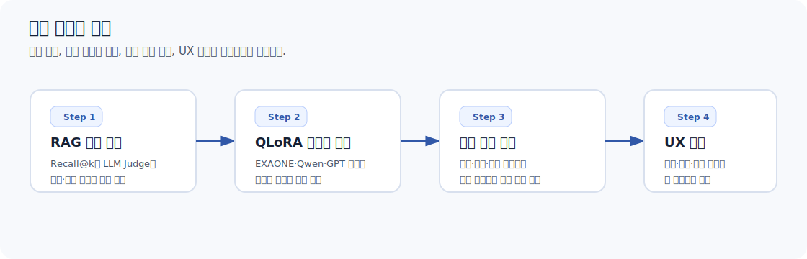
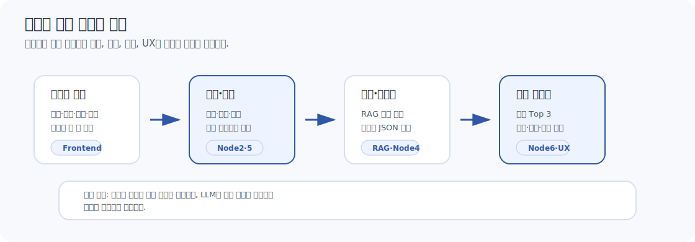
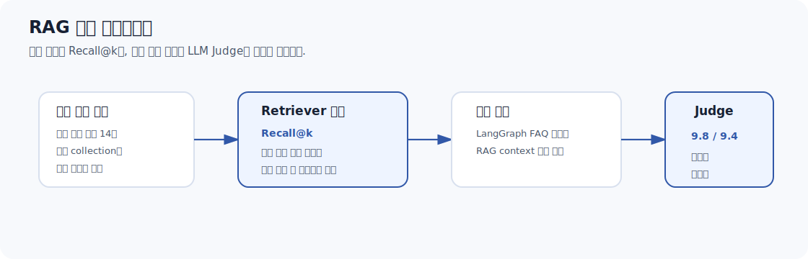
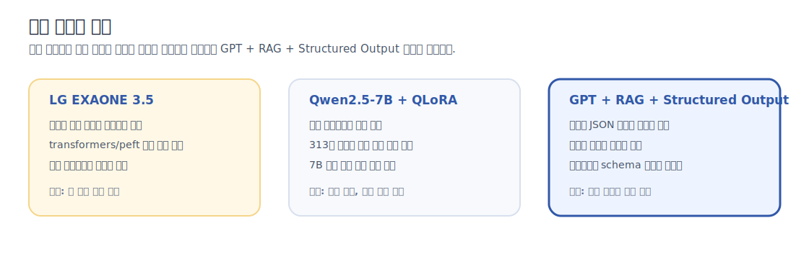
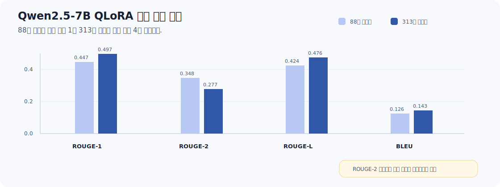

# 청약 랭그래프 시스템 품질 고도화 통합 보고서

## 1. 요약

청약 랭그래프 시스템은 사용자의 청약 조건을 입력받아 가능한 공급유형, 가점 근거, 공고 기준 분석, 자금 리스크, FAQ 질의응답을 제공하는 Streamlit-FastAPI-LangGraph 기반 서비스다. 본 문서는 최종 제출물 중 품질 고도화 영역을 정리한다.

이번 고도화의 핵심은 모델을 더 크게 만드는 것이 아니라, **검색 근거를 점검하고, 전략 판단의 모순을 줄이며, 사용자가 결과를 이해할 수 있는 화면으로 재구성한 것**이다.

본 문서에서 다루는 범위는 네 가지다.

| 구분 | 주제 | 핵심 산출물 |
| --- | --- | --- |
| 1 | RAG 정량 평가 및 LLM Judge 보완 | Recall@k, Faithfulness, Answer Relevance 평가와 한계 정리 |
| 2 | LoRA/QLoRA 튜닝 실험 | EXAONE, Qwen, GPT 적용성 비교와 튜닝 전후 성능 비교 |
| 3 | 청약 전략 개선 및 버그 수정 | 추천 순위, 점수 계산, 자금 리스크, 최종 리포트 로직 개선 |
| 4 | 프론트엔드 UX 및 응답 구조 개선 | 결과 화면, FAQ 챗봇, 라이트/다크 테마, payload 표시 개선 |

---

## 2. 시스템 품질 고도화 구조

청약 랭그래프 시스템은 단순한 챗봇이 아니라, 사용자의 입력값을 계산 로직과 RAG 응답으로 연결하는 진단형 서비스다. 

따라서 품질 고도화는 단일 모델 성능이 아니라 **입력, 계산, 검색, 생성, 화면 출력이 연결되는 전체 파이프라인 기준**으로 설계했다.

품질 고도화는 다음 세 축으로 정리된다.

- **검색 품질**: 청약 법령, FAQ, 업무매뉴얼, LH 가이드 등 필요한 문서가 검색 경로에 안정적으로 연결되도록 평가했다.
- **판단 품질**: 추천 공급유형, 경쟁력, 자금 리스크, 가점 근거가 서로 모순되지 않도록 계산 로직과 최종 조립 구조를 정리했다.
- **사용자 이해도**: 결과를 표, 카드, 요약, 상세 근거로 나누어 처음 보는 사용자도 판단 근거와 다음 행동을 확인할 수 있게 했다.

---

## 3. RAG 정량 평가 및 LLM Judge

### 3.1 평가 목적

RAG 품질은 “답변이 자연스럽다”만으로 판단하기 어렵다. 

청약 서비스에서는 **사용자가 실제 제도 판단에 참고할 수 있도록, 검색 문서가 맞고 답변이 근거를 벗어나지 않는지**가 중요하다. 

이를 위해 검색 단계와 생성 단계를 나누어 평가했다.

### 3.2 Recall@k 평가

`branching/SKN29-chatbot-work/tests/eval_recall.py`를 기준으로 14개 대표 질문에 대해 필요한 문서가 검색 결과에 포함되는지 확인했다.

| 평가 항목 | 내용 |
| --- | --- |
| 검색 대상 | `law_chunks`, `faq_chunks`, `manual_chunks`, `lh_guide_chunks`, `web_faq_chunks`, `guide_chunks` |
| 평가 방식 | 질문별로 기대 collection과 필수 포함 키워드를 지정 |
| 판정 기준 | `must_contain`, `any_of` 조건을 통해 k개 검색 결과 안에 필요한 근거가 있는지 확인 |
| 주요 시나리오 | 신혼부부 특공, 생애최초 특공, 다자녀 특공, 무주택기간, 세대주 요건 등 |

Recall@k 평가는 답변 생성 이전에 **검색기가 필요한 문서를 찾아오는지**를 확인하는 단계다. 

이 과정에서 검색 누락이 확인되면 프롬프트나 LLM을 고치기 전에 collection 구성, metadata, 검색 라우팅을 먼저 점검해야 한다.

### 3.3 LLM Judge 평가

`branching/SKN29-chatbot-work/tests/eval_llm.py`에서는 LangGraph 응답을 생성한 뒤, `gpt-4o-mini`를 Judge 모델로 사용해 답변 품질을 평가했다.

| 질문 유형 | 도메인 | Faithfulness | Answer Relevance | 해석 |
| --- | --- | --- | --- | --- |
| 청약통장 가입일 관련 질문 | cheongyak | 10 | 10 | 검색 근거 기반 답변이 안정적 |
| 무주택 기준 관련 질문 | cheongyak | 10 | 10 | 답변 관련성과 근거 충실도 양호 |
| 세대주 여부 관련 질문 | cheongyak | 9 | 10 | 일부 조건 설명 보강 필요 |
| 공고 기준 관련 질문 | cheongyak | 10 | 7 | 공고별 예외 안내 강화 필요 |
| 일반 질문 | general | 10 | 10 | 도메인 밖 질문 방어 양호 |
| **평균** | - | **9.8** | **9.4** | 근거성은 높고, 일부 상세 조건 안내가 개선 대상 |

평가 결과 RAG 응답의 기본 신뢰도는 확보되었다. 이후 개선에서는 청약 제도의 예외 조건과 공고별 차이를 더 명확히 안내하는 방향으로 응답 구조를 정리했다.

### 3.4 개선 적용 지점

| 발견 사항 | 원인 | 적용한 개선 방향 |
| --- | --- | --- |
| 공고별 예외 조건 설명 부족 | FAQ 중심 검색 결과에 의존 | 공고문 구조화 결과를 함께 반영 |
| 출처가 답변 하단에 과도하게 중복 | 생성 답변과 UI 표시가 중복 | 출처를 칩 형태로 정리하고 중복 제거 |
| 답변은 맞지만 사용자가 바로 이해하기 어려움 | 법령 문장 중심 응답 | 요약, 조건, 예외, 다음 행동 순서로 응답 구조화 |

---

## 4. QLoRA 튜닝 실험과 최종 적용성 평가

### 4.1 실험 목적 재정의

QLoRA 튜닝 실험의 목적은 청약 가점 계산이나 자격 판정을 LLM에 맡기기 위한 것이 아니다.  
청약 가점 계산과 자격 판정은 명확한 규칙과 수치 기준이 중요하므로, Python 기반 규칙 로직과 MCP 도구가 담당하는 편이 더 안정적이다.

따라서 본 실험의 목적은 다음 두 가지로 제한했다.

> 1. RAG context를 바탕으로 GPT와 유사한 한국어 답변 스타일을 로컬 모델이 학습할 수 있는지 확인한다.
> 2. GPT API 의존도를 낮추기 위한 장기적 대체 후보로 로컬 생성 모델의 가능성을 검토한다.

반대로, 공고문 구조화(JSON 추출)나 분기 판단이 목적이라면 7B급 모델을 QLoRA로 튜닝하는 방식은 가장 경제적인 선택이라고 보기 어렵다.  
이 영역은 프롬프트 엔지니어링, Pydantic schema, Structured Output, 후처리 검증 로직을 조합하는 방식이 더 직접적이고 안정적이다.

따라서 본 프로젝트의 최종 적용 판단은 다음과 같다.

- **가점 계산**: LLM이 아니라 백엔드 규칙 기반 계산 로직이 담당한다.
- **공고문 구조화**: GPT 기반 Structured Output과 schema 검증을 우선 적용한다.
- **RAG 답변 생성**: GPT를 기본 생성 모델로 유지하고, QLoRA 기반 로컬 모델은 장기 연구 후보로 남긴다.

### 4.2 EXAONE, Qwen, GPT 적용성 비교

| 비교 항목 | LG EXAONE 3.5 | Qwen2.5-7B + QLoRA | GPT + RAG + Structured Output |
| --- | --- | --- | --- |
| 도입 배경 | 한국어 성능 기대 | 표준 `transformers` 호환, 4bit QLoRA 가능 | 기존 서비스 구조와 가장 잘 맞음 |
| 장점 | 국내 모델이라는 상징성 | 로컬 실행 가능, 비용 통제 가능 | 구조화 출력, 안정성, 개발 속도 우수 |
| 한계 | `peft`/`transformers` 호환 이슈 | 7B GPU 비용, 데이터 품질 의존, 운영 복잡도 | API 비용과 외부 의존성 |
| 적합 영역 | 추가 호환성 확보 후 재검토 | 답변 스타일 학습 연구 | 공고문 구조화, 최종 리포트 생성, FAQ 답변 |
| 최종 판단 | 현 단계 적용 보류 | 실험 가치는 있으나 운영 적용 보류 | 최종 서비스 기본 경로 |

EXAONE은 한국어 모델이라는 장점이 있었지만, `trust_remote_code`, embedding 접근, `peft` 호환성 문제로 학습 파이프라인 안정화가 어려웠다. 

Qwen2.5-7B는 표준 생태계와 호환되어 QLoRA 실험에는 적합했지만, 실제 서비스에서 필요한 JSON 구조화와 검증은 GPT의 Structured Output이 더 직접적이었다.

### 4.3 Qwen2.5-7B QLoRA 실험 결과

튜닝 데이터는 GPT가 RAG context를 바탕으로 생성한 `(context, question, answer)` 형식으로 구성했다. 

데이터는 v1, v2, v3로 확장했고, 최종적으로 313개 학습 샘플을 사용했다.

| 실험 | 데이터 수 | 학습 조건 | ROUGE-1 | ROUGE-2 | ROUGE-L | BLEU |
| --- | ---: | --- | ---: | ---: | ---: | ---: |
| 실험 1 | 88개 | lr=2e-4, epoch=3 | 0.4472 | 0.3477 | 0.4244 | 0.1259 |
| 실험 2 | 178개 | lr=2e-4, epoch=3 | 0.4472 | 0.3477 | 0.4244 | 0.1259 |
| 실험 3 | 178개 | lr=2e-4, epoch=1 | 평가 제외 | 평가 제외 | 평가 제외 | 평가 제외 |
| 실험 4 | 313개 | lr=2e-4, epoch=3 | 0.4972 | 0.2771 | 0.4763 | 0.1427 |
| 실험 5 | 313개 | lr=1e-4, epoch=3 | 0.4972 | 0.2771 | 0.4763 | 0.1427 |

데이터를 88개에서 313개로 늘렸을 때 ROUGE-1은 0.4472에서 0.4972로, ROUGE-L은 0.4244에서 0.4763으로 상승했다. 

BLEU도 0.1259에서 0.1427로 소폭 개선되었다. 다만 ROUGE-2는 0.3477에서 0.2771로 하락했다. 

이는 **더 긴 답변을 생성하면서 전체 의미 흐름은 개선되었지만, GPT 기준 답변과 동일한 2-gram 표현을 재현하는 능력은 떨어졌다**는 의미로 해석된다.

### 4.4 정량 지표 해석

| 관찰 결과 | 해석 |
| --- | --- |
| ROUGE-1 상승 | 핵심 단어 선택이 개선되었다. |
| ROUGE-L 상승 | 답변의 전체 문장 흐름이 GPT 기준 답변에 가까워졌다. |
| BLEU 소폭 상승 | 표현 일치도가 일부 개선되었다. |
| ROUGE-2 하락 | 문장 단위 표현 재현성은 여전히 불안정하다. |
| epoch=1 실험의 중국어 출력 | base model의 다국어 성향이 충분히 제어되지 않았다. |
| learning rate 차이 영향 미미 | 현재 데이터 규모에서는 하이퍼파라미터보다 데이터 품질 영향이 더 컸다. |

ROUGE와 BLEU는 답변의 표현 유사도를 측정하지만, 청약 도메인에서 중요한 “법적 근거의 정확성”이나 “사용자 조건과의 논리적 일치”를 충분히 평가하지 못한다. 

실제 실험에서도 의미상 유사한 답변이 낮은 ROUGE 점수를 받는 경우가 있었다. 

따라서 향후에는 **LLM Judge, 사람 평가, 출처 기반 사실성 평가를 병행**해야 한다.

### 4.5 파인튜닝 가성비 판단

| 질문 | 결론 |
| --- | --- |
| 청약 가점 계산을 위해 7B 튜닝이 필요한가 | 필요하지 않다. 계산은 Python 규칙 로직과 MCP 도구가 더 정확하다. |
| 공고문 구조화(JSON 추출)를 위해 7B 튜닝이 필요한가 | 우선순위가 낮다. GPT Structured Output, Pydantic schema, 후처리 검증이 더 직접적이다. |
| RAG 답변 스타일 학습에는 의미가 있는가 | 실험 가치는 있다. 다만 313개 데이터와 현재 GPU 비용으로는 GPT 대체 수준에 도달하지 못했다. |
| 최종 서비스에 QLoRA를 넣는 것이 맞는가 | 현 단계에서는 제외하는 것이 합리적이다. RAG 검색, 구조화 출력, 전략 로직, UX 개선이 더 큰 효과를 냈다. |

결론적으로 QLoRA는 연구용 실험으로 의미가 있었지만, 최종 서비스 품질을 높이는 핵심 수단은 아니었다. 

본 프로젝트에서 LLM의 역할은 **계산자가 아니라 설명자**이며, 안정적인 서비스 품질은 구조화 출력, 검증 로직, 검색 품질, 사용자 화면 개선을 통해 확보하는 것이 더 적절하다.

---

## 5. 청약 전략 개선 및 버그 수정

### 5.1 개선 배경

RAG와 QLoRA 평가를 통해 모델 자체보다 시스템 역할 분리가 중요하다는 점을 확인했다. 

실제 서비스 품질 문제도 대부분 “모델이 답을 못한다”가 아니라, 계산 결과와 최종 리포트가 맞물리는 방식에서 발생했다.

발생한 주요 문제는 다음과 같다.

| 문제 | 원인 | 개선 결과 |
| --- | --- | --- |
| 신혼부부 특공 누락 | profile payload와 내부 schema의 detail 필드 불일치 | 추천 결과에 신혼부부 특공 반영 |
| 일반공급 가점 0점 | 일부 점수 필드가 최종 결과에 연결되지 않음 | 일반공급 가점 정상 표시 |
| 부적격 유형이 추천 상위에 노출 | 자격 미충족 항목도 단순 점수로 정렬 | 자격 조건을 우선 반영 |
| 다자녀 45퍼센트를 경쟁력 있음으로 표시 | 점수 비율 기준이 불명확 | 경쟁력 표현을 보수적으로 조정 |
| 자금 리스크 경고가 결과와 따로 노출 | 재무 분석 결과가 최종 전략과 약하게 연결 | 최종 리포트에서 자금 계획 안내 강화 |

### 5.2 개선 원칙

개선 방향은 다음 세 가지 원칙을 따랐다.

> 1. 계산 가능한 값은 Python 로직으로 산출한다.
> 2. LLM은 계산 결과를 임의로 바꾸지 않고 설명만 담당한다.
> 3. 사용자는 추천 순위, 점수 근거, 공고 기준, 자금 리스크를 한 화면에서 확인할 수 있어야 한다.

### 5.3 주요 수정 영역

| 영역 | 수정 내용 | 관련 파일 |
| --- | --- | --- |
| 공급유형 점수 | 80/60/40퍼센트 기준으로 높음, 보통, 낮음, 확인 필요 구분 | `Backend/src/engine/node2.py` |
| 추천 순위 | 자격 충족 여부와 점수 경쟁력을 함께 고려 | `Backend/src/engine/node2.py`, `strategy_tools.py` |
| 최종 조립 | Node5 결과와 Node6 최종 리포트 연결 강화 | `Backend/src/engine/node5.py`, `Backend/src/engine/node6.py` |
| 자금 리스크 | 분양가, 대출 가능액, 실투자금, 총자산 대비 부담률 표시 | `financial.py`, `node5.py` |
| 결과 화면 | 추천 Top 3, 점수 근거, 상세 근거, 개발자 payload 분리 | `Frontend/views/diagnosis_page.py` |

### 5.4 Before / After

| 항목 | 개선 전 | 개선 후 |
| --- | --- | --- |
| 45퍼센트 점수 해석 | 경쟁력 있음 | 보통 또는 추가 확인 필요 |
| 추첨제 공급유형 | 점수 산정 없음으로만 표시 | 추첨제 동등 기회와 병행 신청 가능성 안내 |
| 추천 결과 | 단순 점수 중심 | 자격, 점수, 공고 기준, 자금 리스크를 함께 반영 |
| 최종 전략 | 긴 문단 중심 | 핵심 요약, 다음 행동, 상세 근거로 분리 |

---

## 6. 프론트엔드 UX 및 응답 구조 개선

### 6.1 개선 목표

프론트엔드는 단순히 백엔드 응답을 출력하는 영역이 아니라, 사용자가 청약 판단을 이해하는 마지막 단계다. 

따라서 결과 화면은 “개발자가 보기 쉬운 JSON”이 아니라 **“사용자가 다음 행동을 결정할 수 있는 리포트”** 가 되어야 한다.

### 6.2 결과 화면 개선

| 개선 항목 | 내용 |
| --- | --- |
| 추천 Top 3 카드 | 추천 공급유형을 순위 카드로 표시하고 점수, 방식, 경쟁력을 함께 제공 |
| 상세 근거 expander | 각 공급유형별 점수 구성과 출처를 필요할 때 펼쳐볼 수 있도록 구성 |
| 자금 리스크 안내 | 분양가, 대출 가능액, 실투자금, 부담 수준을 요약 |
| 개발자 payload 분리 | 발표와 디버깅에는 필요하지만 일반 사용자의 주 흐름에서는 접어둠 |
| 다시 실행 버튼 | 결과를 다 읽은 뒤 자연스럽게 재진단할 수 있도록 하단 CTA로 이동 |

### 6.3 FAQ 챗봇 개선

FAQ 챗봇은 단순 답변보다 출처 정리가 중요했다. 

기존에는 답변 본문과 하단 출처가 중복되거나, 긴 출처 문자열이 그대로 노출되어 사용자가 읽기 어려웠다.

개선 방향은 다음과 같다.

> - 출처는 칩 형태로 분리해 가독성을 높인다.
> - 답변은 요약, 조건, 예외, 다음 확인 항목 순서로 정리한다.
> - 긴 답변에서는 출처를 본문에 반복하지 않고 하단에 모아 표시한다.
> - 라이트 모드와 다크 모드에서 질문, 답변, 입력창, 버튼의 대비를 맞춘다.

### 6.4 라이트/다크 테마와 서비스명

발표 환경에서 일관된 화면을 보여주기 위해 라이트/다크 테마를 직접 선택할 수 있게 했다. 

서비스명은 최종적으로 **청약 랭그래프 시스템**으로 정리했다.

| 항목 | 개선 내용 |
| --- | --- |
| 서비스명 | 내집각에서 청약 랭그래프 시스템으로 변경 |
| 테마 선택 | 사이드바에서 라이트/다크 선택 |
| 다크 모드 | 입력창, placeholder, expander, 버튼, 카드 경계선 대비 개선 |
| 랜딩 화면 | 사용자가 서비스 가치를 빠르게 이해하도록 hero 영역과 결과 미리보기 구성 |

---

## 7. 최종 판단

이번 고도화에서 도출된 결론은 **"청약 서비스에서 품질은 단일 LLM의 크기보다 역할 분리와 검증 가능한 구조에서 나온다"** 이다.

| 영역 | 최종 판단 |
| --- | --- |
| 계산 | Python 규칙 로직과 MCP 도구가 담당 |
| 공고문 구조화 | Structured Output과 schema 검증이 우선 |
| RAG 답변 | 검색 근거와 출처 정리가 핵심 |
| 파인튜닝 | 연구 가치는 있으나 최종 서비스 적용은 보류 |
| UX | 사용자가 추천 이유와 다음 행동을 이해하도록 결과 구조를 단순화 |

QLoRA 실험은 “무조건 로컬 모델로 대체하자”는 결론이 아니라, 현재 프로젝트 범위에서 무엇을 LLM에게 맡기고 무엇을 백엔드가 책임져야 하는지를 명확히 해준 실험이었다. 

최종 시스템은 GPT 기반 RAG와 구조화 출력, 백엔드 계산 로직, 사용자 중심 프론트엔드를 결합하는 방향이 가장 안정적이라고 판단했다.

---

## 8. 향후 개선 과제

| 과제 | 개선 방향 |
| --- | --- |
| 공고문 구조화 정밀도 | Pydantic schema 기반 필드 검증과 누락 필드 재질문 흐름 강화 |
| RAG 평가 확대 | Recall@k 문항 수 확대, collection별 실패 사례 축적 |
| LLM Judge 보완 | 사람 평가와 LLM Judge를 병행하여 법적 근거 정확성 평가 |
| QLoRA 후속 연구 | 313개보다 큰 고품질 데이터셋, 한국어 gold answer, 도메인별 평가셋 구축 |
| UX 검증 | 실제 사용자 테스트를 통해 입력 이탈 구간과 결과 이해도 측정 |
