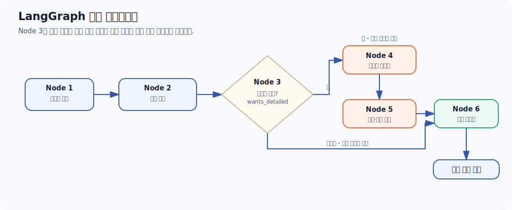
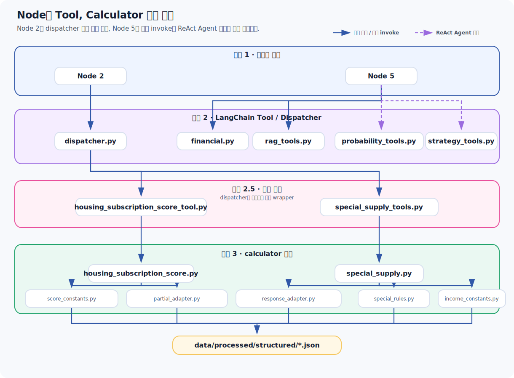

# LangGraph 파이프라인 아키텍처 리포트

## 1. 개요

본 리포트는 대한민국 주택 청약 자격 진단 및 전략 추천을 수행하는 RAG 기반 시스템의 백엔드 파이프라인 구조를 정리한다.

이 시스템은 LangGraph 기반의 6개 노드(Node 1~6)를 중심으로 동작한다. 

각 노드는 사용자 프로필 진단, 공급유형 추천, 상세 진단 분기, 공고문 파싱, 전략 추론, 최종 리포트 생성을 단계적으로 수행한다. 

노드 내부에서는 8개의 LangChain 툴이 호출되며, 이 툴들은 실제 계산과 판정을 담당하는 8개의 calculator 하위 모듈에 의존한다.

전체 구조의 핵심은 결정론적 규칙 기반 계산과 LLM 기반 추론을 분리하는 데 있다. 

청약 가점, 자격 판정, 금융 계산처럼 명확한 기준이 있는 영역은 코드와 데이터 테이블로 처리하고, 전략 설명, 사용자 맞춤 해석, 응답 문장 구성처럼 맥락 해석이 필요한 영역은 LLM이 담당하도록 설계했다.

핵심 설계 철학은 다음 한 문장으로 요약할 수 있다.

> 점수와 자격 판정처럼 정답이 있는 영역은 코드와 데이터 테이블로 고정하고, 전략 설명과 톤처럼 정답이 하나로 고정되지 않는 영역만 LLM에 맡긴다.

이 원칙은 노드 분리, LangChain 툴 분리, calculator 계층 분리 전반에 적용되어 있으며, 시스템이 설명 가능성과 유연성을 동시에 확보하도록 한다.

---

## 2. 전체 파이프라인 흐름 (Node 1~6)

> **이미지 범례**
>
> ● 파란색 : 계산 노드 (규칙 기반 계산)
>
> ● 주황색 : 에이전트 노드 (LLM / RAG / 전략 추론)
>
> ● 초록색 : 결과 생성 노드 (최종 리포트 생성)

#### 파이프라인은 단순한 선형 흐름이 아니라 조건 분기를 포함한 구조다.

이 파이프라인은 Node 1에서 Node 6까지 순차적으로 진행되지만, 중간에 사용자의 선택에 따라 경로가 갈라진다. 핵심 분기 기준은 사용자가 **공고문 기반 상세 시뮬레이션**을 원하는지 여부다.

**기본 진단 흐름**

Node 1은 사용자 프로필을 입력받아 어떤 특별공급 유형에 지원 가능성이 있는지 1차 판별한다. 동시에 이후 계산 툴에 전달할 입력 페이로드를 생성한다.

Node 2는 Node 1에서 생성한 페이로드를 바탕으로 실제 계산기 툴을 호출한다. 이 단계에서 특별공급 유형별 점수, 일반공급 가점, 추천 순위인 `supply_rank`가 산출된다.

Node 1과 Node 2는 모두 결정론적 계산 구간이다. 청약 자격과 점수 산출은 코드 기반 규칙과 데이터 테이블을 사용하며, 이 구간에서는 LLM을 호출하지 않는다.

**분기 판단**

Node 3는 실제 계산을 수행하는 노드가 아니라 라우팅 판단을 위한 얇은 노드다. 사용자의 `wants_detailed_diagnosis` 값을 확인해 상세 시뮬레이션을 진행할지 결정한다.

실제 그래프 분기 처리는 `pipeline.py`의 `add_conditional_edges`에서 이루어진다. Node 3의 `route_node3` 함수는 조건부 엣지가 참조할 리터럴 값만 반환한다.

- 상세 시뮬레이션을 원하지 않으면 Node 6으로 이동한다.
- 상세 시뮬레이션을 원하면 Node 4로 이동한다.

**상세 시뮬레이션 흐름**

상세 시뮬레이션을 원하지 않는 경우, Node 6은 Node 2의 추천 결과만을 사용해 간단 리포트를 생성한다.

상세 시뮬레이션을 원하는 경우, Node 4에서 `interrupt()`를 호출해 그래프를 일시정지한다. 이때 사용자는 관심 공고문 정보를 자유 텍스트로 입력한다. 입력 예시는 지역, 분양가, 평형, 공급 세대수, 공급 유형 등이다.

Node 4는 입력된 자유 텍스트를 OpenAI structured output 기능으로 `AnnouncementSchema`에 맞춰 정형화한다. 이렇게 생성된 공고문 정형 데이터는 Node 5로 전달된다.

Node 5는 공고문 정형 데이터와 사용자 프로필, Node 2의 추천 결과를 함께 사용해 상세 전략 분석을 수행한다. 이 단계에서는 다음 항목을 종합적으로 계산하거나 분석한다.

- 대출 가능 금액
- 실투자금
- 자금 리스크
- 당첨 경쟁력
- 지역 우선공급 여부
- 청약 시점 적합성
- 공급유형별 전략 비교

마지막으로 Node 6은 `wants_detailed_diagnosis` 값을 다시 확인해 최종 리포트 형태를 결정한다. 상세 시뮬레이션을 거치지 않은 경우에는 간단 리포트를 생성하고, Node 5까지 수행된 경우에는 공고문 분석과 금융 분석, 전략 추론 결과를 포함한 상세 리포트를 생성한다.

### 2.1 왜 이런 구조로 분리했는가

- 세 가지 설계 이유

첫째, **비용과 응답 속도의 분리**다. 모든 사용자가 공고문 시뮬레이션까지 원하는 것은 아니므로, Node 1~2의 결정론적 분석만으로 충분한 사용자는 Node 4~5의 LLM 호출(structured output 추출 1회 + ReAct Agent 내부의 여러 차례 LLM 호출)을 거치지 않고 즉시 결과를 받을 수 있다. 이는 응답 지연과 토큰 비용을 사용자 의도에 따라 차등 적용하는 구조다.

둘째, **인터럽트가 필요한 지점만 그래프 일시정지로 처리**한다는 점이다. Node 4가 `interrupt()`를 호출하는 이유는 공고문 정보가 사전에 알 수 없는 사용자 입력이기 때문이다. FastAPI 쪽에서 `Command(resume=...)`로 재개하는 구조와 맞물려, Node 1~3에서 이미 확보된 프로필 정보는 별도 인터럽트 없이 흘러가고, 정말 외부 입력이 필요한 지점에서만 그래프가 멈춘다.

셋째, **State 오염 방지**다. Node 2의 docstring에 명시되어 있듯, 프론트엔드로 반환할 `supply_rank`(UI 표시용, 풍부한 필드 포함)와 State 내부에서 다음 노드로 전달할 `supply_analysis`(Node 5 입력용, 계산에 필요한 필드만 포함)를 분리해서 반환한다. 이는 한 노드의 출력이 "그래프 내부 상태"와 "API 응답 페이로드"라는 두 가지 다른 소비자를 갖는다는 점을 인식하고 의도적으로 나눈 것으로, 한쪽의 포맷 변경이 다른 쪽에 영향을 주지 않도록 막는다.

---

## 3. Node별 상세 분석

### 3.1 Node 1 — 프로필 정규화 및 가능 특공 판별

- Node 1의 역할은 두 가지다.   

첫째, 사용자 프로필의 다양한 입력 형태(영문 enum, 한글 텍스트, boolean, 숫자)를 정규화해 어떤 특공 유형(`신혼부부 특공`, `다자녀 특공`, `생애최초 특공`)이 후보가 될 수 있는지 판별한다.  

둘째, 이후 Node 2가 호출할 계산기 툴들의 입력 페이로드(`special_supply`, `housing_subscription_score`)를 미리 빌드해둔다.

사용자 프로필이 어디서 채워지는지(프론트 폼, 챗봇 자유 입력 등)에 따라 `"예"`, `"true"`, `True`, `1`처럼 형태가 달라질 수 있는데, 이를 한 곳에서 일괄 처리함으로써 이후 모든 계산 로직이 깨끗한 타입(`bool | None`, `int | None`)만 다루도록 보장한다. `_bool_value`가 알 수 없는 값에 대해 `None`을 반환하고 함부로 `False`로 단정하지 않는 점도 중요한데, 이는 뒤에서 다룰 special_supply.py의 "unknown은 절대 불리한 답으로 임의 해석하지 않는다"는 원칙과 맞닿아 있다.

### 3.2 Node 2 — 특공 추천 및 순위 산정 (청약 자격 분석)

- Node 2는 Node 1이 만든 `tool_inputs`를 받아 `run_calculator_tools`(dispatcher.py)를 호출하고, 그 결과를 사용자에게 보여줄 순위표(`supply_rank`)로 가공한다. 가점제(점수 기반)와 추첨제(자격 기반)를 구분해서 처리하는 점이 핵심이다.

- 순위 결정 로직(`_build_supply_rank`)은 다음 우선순위를 따른다. 
1. 신청 가능한 추첨제 특공이 있고 점수제 특공의 경쟁력이 임계치(`COMPETITIVENESS_THRESHOLD = 0.6`, 즉 60%) 미만이면 추첨제를 1순위로, 점수제를 보조 전략으로 배치한다.
2. 반대로 점수제 경쟁력이 60% 이상이면 점수제를 우선 추천한다. 
3. 신청 가능한 확정 특공이 전혀 없으면 일반공급을 최우선으로 둔다. 
4. 자격 미확정 항목(`missing_items`가 있는 추첨제)은 항상 순위 맨 뒤로 분리해, 사용자가 "아직 확인이 필요한 항목"과 "지금 신청 가능한 항목"을 혼동하지 않게 한다.

원래는 점수 비율이 45%인 항목도 "경쟁력 있음"으로 표시되는 문제가 있었고, 이를 80/60/40% 3단계 구간(`_score_competitiveness`)으로 나누어 보정했다. 이는 실제 운영 중 발견된 경험 이슈를 데이터 기반으로 수정한 사례로 볼 수 있다.

### 3.3 Node 3 — 분기 라우터

- 앞서 설명한 대로 상태 변경 없이 라우팅 정보만 반환하는 순수 함수형 노드다. `wants_detailed_diagnosis` 값이 `{"예", "yes", True, "true"}` 집합에 속하는지로 분기한다.

### 3.4 Node 4 — 공고문 인터럽트 노드

- `langgraph.types.interrupt()`로 그래프를 멈추고 사용자의 자유 텍스트 입력을 기다린다. 입력이 들어오면 `ChatOpenAI.with_structured_output()`과 Pydantic `AnnouncementSchema`를 사용해 지역, 규제 여부, 공급유형, 분양가, 평형, 공급세대수를 추출한다. "5억"처럼 자연어로 들어오는 금액 표현을 원 단위 정수로 변환하도록 필드 설명(`description`)에 명시해 LLM이 일관된 형식으로 파싱하게 만든 점이 특징이다.

- 이 노드를 별도로 분리한 이유는 공고문 정보는 정형 DB나 사용자 프로필 어디에도 존재하지 않는, 매 요청마다 새로 입력받아야 하는 데이터이기 때문에 그래프 흐름 자체를 멈추고 받는 것이 가장 단순한 처리 방식이다.

### 3.5 Node 5 — 하이브리드 ReAct 전략 에이전트 (청약 전략 수립 노드)

- Node 5는 전체 파이프라인에서 "하이브리드"라는 이름처럼 두 가지 실행 방식을 한 노드 안에 섞어 쓴다.

    **STEP 1 (고정 순서 실행):** `calculate_loan_amount` → `calculate_real_investment` → `analyze_financial_risk` → `check_regional_priority`를 코드로 직접, 순서를 강제해 호출한다. 이 네 가지는 서로 출력이 다음 입력이 되는 명확한 의존 관계(대출액 → 실투자금 → 리스크)를 가지고 있어, LLM에게 호출 순서를 맡기면 잘못된 순서로 부르거나 빠뜨릴 위험이 있다. 코드에서 직접 호출함으로써 이 위험을 원천적으로 제거했다.

    **STEP 2 (`create_react_agent`):** 나머지 세 개 툴(`compare_supply_strategy`, `calculate_winning_probability`, `analyze_subscription_timing`)은 ReAct 에이전트에게 맡긴다. 이 세 개는 서로 강한 순서 의존성이 없고, 호출 결과를 사람이 읽을 자연어로 종합 설명해야 하는 영역이라 LLM의 자유도가 필요하다.

이 설계는 "결정론적으로 계산 가능한 것은 절대 LLM에 맡기지 않는다"는 원칙을 Node 5 내부에서도 한 번 더 적용한 것이다. 코드에서 고정 실행한 `loan_result`, `risk_result`, `regional_result`의 수치를 단순히 State에만 넣는 게 아니라 `agent_prompt` 문자열 안에 그대로 박아 넣고 "이 수치는 이미 정확히 계산되었으니 다시 계산하지 말고 그대로 인용하라"고 프롬프트에서 명시적으로 지시하고 있다. 이는 LLM이 이미 계산된 숫자를 임의로 재추정하거나 다른 값으로 착각해 보고서에 쓰는 사고를 막기 위한 방어적 프롬프트 설계이다.

또한 프롬프트 안에는 결과 표현 규칙이 세밀하게 박혀 있는데, 처음부터 이렇게 설계한 게 아니라 에이전트가 실제로 결과를 잘못 설명하는 사례를 겪을 때마다 규칙을 추가해 막은 결과다.
당첨 확률 숫자(winning_score, breakdown)를 노출하지 말고 "참고용 경쟁력 지표"로만 표현하게 한 것은, 에이전트가 내부 점수를 그대로 보여줘서 사용자가 이를 확정된 당첨 확률로 오해하게 만든 문제 때문이다. probability_tools.py가 methodology_notice로 "참고용 추정치이며 실제 경쟁률은 반영되지 않았다"고 명시하는 것도 같은 이유로, 등급("상/중/하")만 보여주고 근거는 reasons 문장으로만 설명하도록 했다.  
"신청 자격"과 "1순위 자격"을 같은 단어로 섞어 쓰지 못하게 한 것은, 에이전트가 "자격은 충족했으나 자격은 충족하지 못했다"처럼 모순된 문장을 만든 적이 있어서다. 신청 자격(special_supply.py의 missing_items)과 1순위 자격(rag_tools.py analyze_subscription_timing의 is_ready)은 코드상 완전히 다른 계산인데, 에이전트가 이를 인지하지 못하고 "자격"이라는 한 단어로 뭉쳐버려 동사를 다르게 써서 구분하라는 규칙과 올바른 예시 문장을 함께 넣었다.  
자금 리스크 수준별 권고 문구를 강제한 것은, 리스크가 "높음"인데도 에이전트가 "적극적으로 참여하라"고 권고해버린 적이 있었기 때문이다. financial.py 계산 결과와 결론이 어긋나는 상황이라, 리스크 3단계별로 허용되는 권고 방향을 직접 명시하고 action_items는 요약 없이 그대로 전달하도록 못박았다.  
세 규칙 모두 같은 이유에서 나왔다. 계산기들이 코드에서는 독립 모듈로 깔끔히 분리되어 있지만, 결과를 하나의 자연어 보고서로 합치는 순간 에이전트가 모듈 간 경계를 뭉개버리는 문제가 반복됐다. 코드 구조의 분리만으로는 출력 품질이 보장되지 않아, 그 분리를 프롬프트 단계까지 명시적으로 끌고 내려와야 했다.  

### 3.6 Node 6 — 최종 리포트 생성

- `wants_detailed_diagnosis` 값을 다시 확인해, 간단 리포트(Node 2 결과만 자연어로 정리)와 상세 리포트(Node 5의 `agent_result`를 그대로 포함)로 나뉜다. 간단 리포트는 GPT(`gpt-5.4-nano`)로 3~5문장 요약을 생성하면서, 마크다운 헤더는 `###`부터만 허용하고 추가 질문 유도 멘트를 넣지 않도록 프롬프트에 명시한다. 이런 형식 제약은 이 리포트가 챗봇 UI에 그대로 렌더링된다는 전제 위에서, 챗봇 응답 톤을 통일하기 위한 장치이다.

---

## 4. 툴 계층 — Node가 호출하는 LangChain 도구

> **이미지 범례**
>
> ● 파란색 : 그래프 노드 계층 (Node 2 / Node 5 실행 출발점)
>
> ● 보라색 : LangChain Tool / Dispatcher 계층
>
> ● 분홍색 : 계산 래퍼 엔드포인트
>
> ● 초록색 : calculator 모듈 (계산 로직 + 데이터 로더)
>
> ● 노란색 : 구조화 데이터 파일 (`data/processed/structured/*.json`)

| 툴 파일 | 호출 노드 | 역할 |
|---|---|---|
| `dispatcher.py` | Node 2 | 후보 특공 유형에 맞는 계산기 툴만 선택 실행 |
| `housing_subscription_score_tool.py` | dispatcher 경유 | 일반공급 가점제 점수 계산 진입점 |
| `special_supply_tools.py` | dispatcher 경유 | 신혼부부/다자녀/생애최초 특공 계산 진입점 |
| `financial.py` | Node 5 (고정 실행) | 대출액, 실투자금, 자금 리스크 |
| `rag_tools.py` | Node 5 (고정 실행 + Agent) | 지역 우선공급, 청약 시점 적합성 (RAG 기반) |
| `probability_tools.py` | Node 5 (Agent) | 6단계 점수 기반 당첨 경쟁력 추정 |
| `strategy_tools.py` | Node 5 (Agent) | 특공/일반공급 전략 비교 |

### 4.1 dispatcher.py — 계산기 선택 실행기

- `run_calculator_tools`는 Node 2의 핵심 진입점이다. `candidate_supply_types`(Node 1이 판별한 가능 특공 목록)를 받아, 각 계산기 툴이 정의된 `supply_type_aliases`와 교집합이 있는지 확인해 필요한 툴만 실행한다. 일반공급 점수 계산(`calculate_housing_subscription_score`)은 항상 실행되고, 나머지 특공 계산기는 후보 목록에 해당 별칭이 있을 때만 실행된다.

- 신혼부부 특공 대상이 아닌 사용자에게는 `calculate_newlywed_special_supply`를 호출조차 하지 않으므로 불필요한 연산을 줄이고, 새로운 특공 유형이 추가될 때도 `NODE2_CALCULATOR_TOOLS` 튜플에 `CalculatorToolSpec` 항목만 추가하면 되는 확장 구조를 갖는다.

### 4.2 financial.py — 재무 3종 계산기

- LTV 기준표(`LTV_TABLE`)를 규제지역 여부와 생애최초 여부의 2x2 매트릭스로 정의해두고, 대출액 → 실투자금 → 리스크 순서로 결과가 다음 계산의 입력이 되는 파이프라인 형태다. 자금 리스크 분석은 단순히 등급만 매기는 게 아니라 리스크 수준별로 구체적인 행동지침(`action_items`)까지 생성해, Node 5의 에이전트 프롬프트가 이 문구를 그대로 인용하도록 설계되어 있다.

### 4.3 rag_tools.py — 검색 기반 정성 분석

- `check_regional_priority`와 `analyze_subscription_timing`은 retriever 모듈(`search`, `format_source`)을 통해 ChromaDB 기반 검색을 수행한 뒤 LLM으로 답변을 합성하는 공통 패턴(`_rag_answer`)을 공유한다. 
- 단순 텍스트 답변 생성에 그치지 않고, `is_same_region`(지역 일치 여부), `is_ready`(1순위 자격 충족 여부) 같은 boolean 판정값도 같은 함수에서 함께 계산해 반환한다는 점이다. 이렇게 하면 RAG 답변(자연어)과 그 답변에서 도출된 정형 판정값(boolean)을 한 번의 호출로 동시에 얻을 수 있어, Node 5의 다른 계산(`calculate_winning_probability`)이 이 boolean 값을 재사용할 수 있다.

- 다만 이 파일에는 코드 중복이 보인다. `search(query)`와 `_load_retriever().search(query)`를 연달아 호출하거나, `prompt | llm | StrOutputParser()`와 `prompt | ChatOpenAI(...) | StrOutputParser()`를 둘 다 정의해두는 등, 리팩토링 과정에서 이전 버전과 새 버전의 코드가 동시에 남아있는 흔적이 있다. 동작에는 문제가 없지만 정리가 필요한 부분이다.

### 4.4 probability_tools.py — 6단계 가중치 합산 모델

- 당첨 경쟁력을 공급방식, 사용자 경쟁력, 공급물량, 지역경쟁도, 평형보정, 추천카드 일치, 거주지역우선순위까지 7개(코드 주석은 "6단계"라 적었지만 실제로는 거주지역 보정이 추가되어 7개 항목) 요인의 가중치 합으로 계산하고 0~100으로 정규화한다. 이 모델은 통계적 추정이 아니라 휴리스틱 룰 테이블 기반이며, 그 사실을 `methodology_notice` 필드로 매번 명시해 사용자가 실제 경쟁률과 다를 수 있음을 인지하게 만든다. Node 5 프롬프트에서 이 수치를 "당첨 가능성"이 아니라 "참고용 경쟁력 지표"로만 표현하도록 강제한 것과 일관된 설계다.

### 4.5 strategy_tools.py — 전략 종합 비교기

- Node 2의 `_build_supply_rank`와 거의 동일한 임계치(`COMPETITIVENESS_THRESHOLD = 0.6`)와 우선순위 로직을 사용해 1순위/2순위 추천을 산출한다. 두 파일이 같은 상수와 비슷한 분기 로직을 따로 가지고 있다는 점은 향후 유지보수 시 주의가 필요한 지점이다. Node 2는 사용자에게 보여줄 순위표를 만들고 strategy_tools는 Node 5 에이전트가 자연어 전략을 설명하기 위한 근거를 만든다는 역할 차이는 있지만, 임계값이 한쪽만 바뀌고 다른 쪽이 누락되면 두 결과가 어긋날 위험이 있다.

---

## 5. Calculator 계층 — 실제 비즈니스 로직과 데이터

- 가장 아래 계층인 calculator 폴더는 두 가지 축으로 나뉜다. 하나는 일반공급 가점제(`housing_subscription_score*.py` 4개 파일), 다른 하나는 특별공급(`special_supply*.py` 2개 파일과 공통 소득 기준 1개)이다.

### 5.1 일반공급 가점제 — 4개 파일로 분리된 이유

- `housing_subscription_score.py`(핵심 계산), `housing_subscription_score_constants.py`(JSON 점수표 로더), `housing_subscription_score_response_adapter.py`(완전한 입력이 있을 때의 출력 변환), `housing_subscription_score_partial_adapter.py`(입력이 일부만 있을 때의 부분 점수 계산)로 나뉜 구조다.

- 핵심 계산 로직(`calculate_housing_subscription_score`)은 무주택기간, 부양가족, 청약통장 가입기간, 배우자 청약통장 합산까지 포함한 전체 84점 만점 점수를 계산하며, 입력 검증을 Pydantic `model_validator`로 엄격하게 처리한다(예: 생년월일이 공고일보다 늦으면 즉시 에러). 점수표 자체는 코드에 하드코딩하지 않고 `housing_subscription_score_tables.json`이라는 외부 데이터 파일에서 로드하며, 이때 `_validate_score_table`로 필수 키가 모두 있는지 사전 검증한다. 이는 법령이나 공고 기준이 바뀔 때 코드를 수정하지 않고 JSON 데이터만 갱신하면 되도록 만든 설계다.

- partial_adapter가 별도로 존재하는 이유는 실제 사용자 입력이 84점 계산에 필요한 모든 필드를 갖추지 못한 경우가 훨씬 흔하기 때문이다. `_try_calculate_complete_score`로 완전한 입력인지 먼저 시도하고, 실패하면 무주택기간/부양가족/청약통장 가입기간 각각을 개별적으로 계산 가능한 항목만 합산하면서 `missing_inputs`와 `next_questions`를 함께 만들어낸다. 이 부분 점수에는 `PARTIAL_SCORE_NOTICE`로 "실제 총점과 다를 수 있다"는 안내가 항상 붙는다.

### 5.2 특별공급 — 6개 공급유형, 1개 공통 점수 테이블 함수

- special_supply.py는 일반공급 프로필 점수, 신혼부부, 다자녀, 생애최초, 신생아, 노부모부양까지 6개 공급유형 계산 함수를 갖는다(다만 현재 dispatcher.py에 등록되어 실제로 그래프에서 쓰이는 것은 신혼부부/다자녀/생애최초 3개뿐이며, 신생아와 노부모부양은 아직 그래프에 연결되지 않은 상태로 보인다).

- 이 파일에서 가장 중요한 설계 원칙은 클래스 docstring에 명시된 "Unknown 값은 절대 false나 불리한 답으로 임의 변환하지 않는다"이다. 실제로 모든 체크 함수(`_check_bool`, `_check_minimum`, `_check_present`)가 값이 `None`이면 `unknown_fields`로, 명확히 조건을 충족하면 `matched_items`로, 명확히 미충족이면 `missing_items`로 분기하는 3단 구조를 일관되게 따른다. 이로 인해 결과 상태도 3단계(`가능성 있음` / `추가 확인 필요` / `가능성 낮음`)로 나뉘는데, 이는 "정보가 부족해서 모르는 것"과 "정보가 있는데 조건을 못 채우는 것"을 명확히 구분하려는 설계 의도다. 이 구분이 흐려지면 자격이 있는 사용자가 정보 부족만으로 "가능성 낮음"으로 잘못 분류될 위험이 있는데, 코드는 이를 피하기 위해 무주택 여부나 핵심 자격 조건이 명확히 `False`로 확인된 경우에만 `_unlikely`를 즉시 반환하고, 나머지는 모두 점수/매칭 항목을 최대한 모아 `_build_result`로 넘긴다.

- 점수 계산 부분(`_score_public_family_table`, `_score_multi_child_table`)은 소득, 자녀 수, 거주기간, 청약통장 납입횟수, 혼인기간 등을 구간별 점수 테이블(`bands`)로 매핑하는 공통 헬퍼(`_score_count_value`, `_score_year_value`)를 재사용한다. 다자녀 특공과 신혼부부/신생아 특공이 부분적으로 다른 항목 구성을 갖지만(`include_marriage_period`, `include_youngest_child_age` 플래그로 제어), 점수 매핑 메커니즘 자체는 공유하도록 만들어 중복을 최소화했다.

### 5.3 데이터와 로직의 분리 — JSON 파일 3종

- `household_income_constants.py`, `housing_subscription_score_constants.py`, `special_supply_rules.py` 세 파일은 모두 같은 패턴을 따른다. `WORKSPACE_ROOT`를 기준으로 `data/processed/structured/` 안의 JSON 파일을 `lru_cache`로 한 번만 로드하고, 필수 키가 빠지면 즉시 명확한 에러(`HouseholdIncomeLoadError`, `ScoreTableLoadError`, `SpecialSupplyRulesLoadError`)를 던진다. 이 구조의 의의는 "법령이나 공고 기준이 개정되어도 코드를 다시 배포하지 않고 JSON 데이터만 교체하면 된다"는 유지보수성과, "데이터 파일이 손상되거나 누락되면 잘못된 점수를 계산하는 대신 즉시 실패한다"는 안전성을 동시에 satisfy한다는 점이다. 특히 `special_supply_rules.py`의 `_validate_special_supply_rules`가 `institution_recommended`(기관추천 특공)가 포함되면 에러를 던지도록 한 부분은, 이 MVP가 의도적으로 특정 공급유형의 범위를 제한하고 있다는 명시적 가드레일이다.

---

## 6. 설계 원칙 종합

전체 구조를 관통하는 설계 원칙을 정리하면 다음과 같다.

**결정론과 생성형의 명확한 분리.** 점수 계산, 자격 판정, LTV 비율, 가점 테이블처럼 정답이 정해진 영역은 전부 순수 Python 함수와 JSON 데이터 테이블로 처리하고, LLM은 자연어 설명 생성과 자유 텍스트 파싱(Node 4의 공고문 추출)에만 사용한다. Node 5의 ReAct Agent조차 재무 계산 3종은 코드로 고정 실행하고 나머지만 에이전트에 맡기는 것도 같은 원칙의 연장이다.

**State와 API 응답의 분리.** Node 2가 `supply_analysis`(그래프 내부 전달용)와 `supply_rank`(프론트 반환용)를 별도로 만드는 것처럼, 그래프 내부 상태와 외부에 노출되는 응답 포맷을 의도적으로 분리해 한쪽 변경이 다른 쪽을 깨지 않게 했다.

**Unknown과 False를 혼동하지 않는 3단 상태 모델.** special_supply.py 전반에 깔린 가능성 있음/추가 확인 필요/가능성 낮음 구조는 정보 부족과 자격 미달을 구분해, 사용자가 실제로는 자격이 있는데 입력 부족만으로 "안 된다"는 오판을 받지 않도록 막는다.

**계산 로직과 원천 데이터의 분리.** 점수표, 소득 기준, 특공 규칙 모두 코드가 아닌 JSON 파일로 외부화되어 있어 법령 개정이나 기준 변경에 대한 대응 비용을 낮춘다.

**계층별 책임 분리(3-tier).** 그래프 노드(오케스트레이션) → LangChain 툴(인터페이스 + dict 변환) → calculator 모듈(실제 계산 + 데이터 로딩)의 3계층 구조가 일관되게 유지되어, 각 계층을 독립적으로 테스트하거나 교체할 수 있는 여지를 남긴다.

다만 본문에서 짚은 대로 rag_tools.py의 중복 코드 흔적, strategy_tools.py와 node2.py 사이의 임계값 중복 등은 향후 리팩토링 시 우선적으로 정리할 만한 지점으로 보인다. 또한 노드 간 데이터가 문자열 값으로 전달되는 구간에서는 명시적 타입이나 Enum으로 계약을 강제하는 것이 안정성을 더 높일 수 있다.

