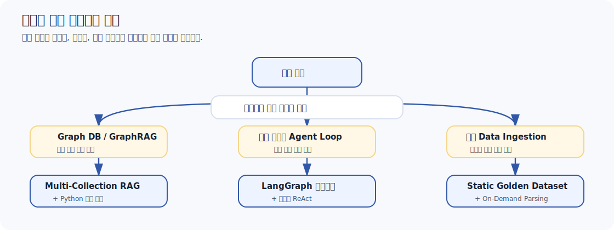
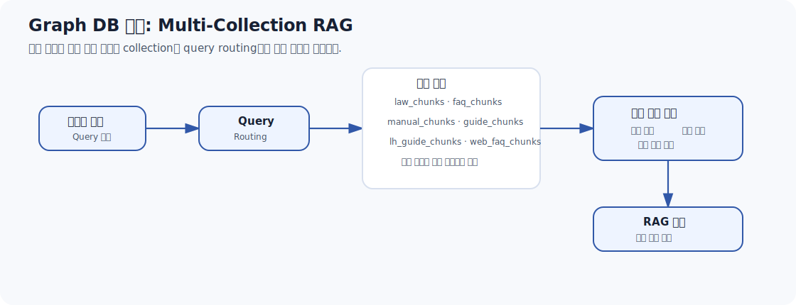
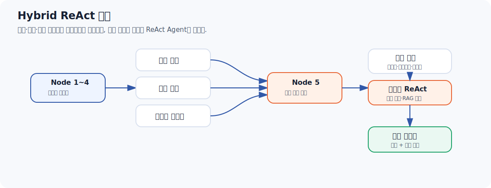
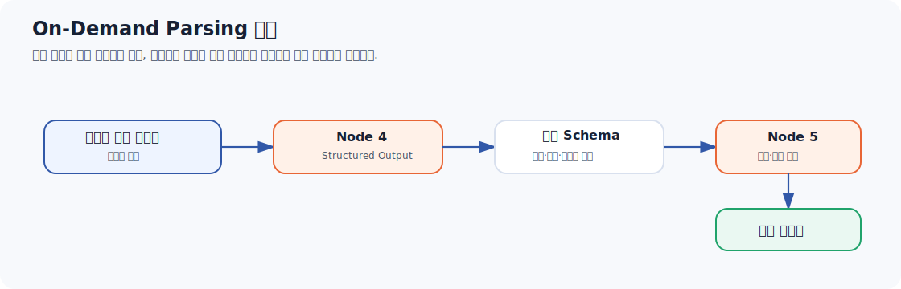
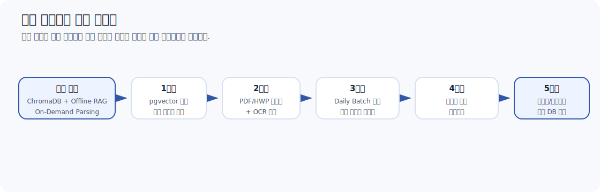

# 미적용 기술 및 대체 설계 보고서

## 1. 핵심 요약

본 문서는 청약 RAG 및 시뮬레이션 진단 시스템 개발 과정에서 검토했지만 최종 설계에는 적용하지 않은 기술 항목과, 그 대신 채택한 대체 설계의 의도를 정리한다.

핵심 판단 기준은 다음과 같다.

> 최신 기술을 많이 붙이는 것보다, 청약 도메인의 특성에 맞게 안정적이고 설명 가능하며 비용 효율적인 구조를 선택한다.

| 미적용 항목 | 미적용 판단 | 대체 설계 |
|---|---|---|
| Graph DB / GraphRAG | 청약 도메인은 관계망 탐색보다 규칙 판정과 수치 비교가 핵심 | ChromaDB 다중 컬렉션 + 쿼리 라우팅 + Python 규칙 계산 |
| 완전 자율형 Agent Loop | 자격 판정과 가점 계산을 Agent에게 맡기면 결과 변동 위험이 큼 | LangGraph 결정론적 워크플로우 + 제한적 ReAct Agent |
| 실시간 데이터 수집 자동화 | 공공 API 지연, 불안정성, 원문 정보 부족, 크롤링 품질 검증 부담 | Offline Golden Dataset + 사용자 주도형 On-Demand Parsing |

---

## 2. 전체 의사결정 구조

현재 구조는 기술을 배제하기 위한 배제가 아니라, **청약 진단의 법적 민감성과 비용 제약을 고려해 더 직접적인 대체 방식을 선택**한 결과다.

---

## 3. Graph DB 및 GraphRAG 미적용

### 3.1 미적용 이유

Graph DB는 개체 간 관계 경로를 탐색하는 데 강하다. 예를 들어 소셜 네트워크, 추천 네트워크, 복합 지식 관계 추적에는 적합하다.

반면 주택청약 제도는 관계망 탐색보다 다음과 같은 결정론적 조건 판정이 중심이다.

| 청약 판단 예시 | 필요한 처리 |
|---|---|
| 무주택 기간이 3년 이상인가 | 수치 비교 |
| 소득 기준이 140% 이하인가 | 기준표 조회 + 수치 비교 |
| 부양가족 수가 몇 명인가 | 입력값 검증 + 점수 매핑 |
| 신혼부부 특공 자격을 만족하는가 | 조건 조합 판정 |

따라서 Graph DB의 관계 경로 탐색 능력은 본 시스템의 핵심 문제와 직접적으로 맞지 않는다.

### 3.2 GraphRAG의 위험

GraphRAG는 LLM을 이용해 텍스트에서 Entity와 Relation을 추출해 지식 그래프를 만든다. 

하지만 청약 법령에서는 단어 하나의 해석 차이가 부적격 판단으로 이어질 수 있다.

| 위험 요소 | 청약 도메인에서의 문제 |
|---|---|
| Entity 추출 오류 | 세대원, 직계존속, 배우자 소득 등 핵심 개념이 왜곡될 수 있음 |
| Relation 추출 오류 | 소득 합산 여부, 자격 관계가 잘못 연결될 수 있음 |
| Hallucination | 존재하지 않는 관계가 그래프에 저장될 수 있음 |
| 유지보수 부담 | 법령 개정 시 그래프 재구축과 검증 비용이 큼 |

청약 질의의 핵심은 "어떤 개체가 어떤 개체와 연결되는가"보다 "어떤 조건을 만족하는가"에 가깝다. 

따라서 GraphRAG의 구조적 장점이 실제 서비스 품질 향상으로 직접 이어질 가능성은 제한적이라고 판단했다.

### 3.3 대체 설계

Graph DB와 GraphRAG 대신 다음 구조를 채택했다.

| 대체 요소 | 역할 |
|---|---|
| `profile_schema.py` | 사용자 입력값 검증과 정규화 |
| `special_supply_tools.py` | 특별공급 자격 및 점수 계산 |
| `housing_subscription_score_tool.py` | 일반공급 가점 계산 |
| ChromaDB 6개 컬렉션 | 문서 성격별 RAG 검색 |
| `route_collections` | 쿼리 키워드 기반 컬렉션 라우팅 |

이 구조는 지식 그래프 없이도 문서 성격에 맞는 정밀 검색을 수행한다. 

또한 Neo4j 같은 별도 그래프 DB 운영 비용 없이 경량 Vector DB인 ChromaDB로 필요한 검색 성능을 확보한다.

---

## 4. 완전 자율형 Agent Loop 미적용

### 4.1 미적용 이유

완전 자율형 Agent Loop는 Agent가 스스로 다음 행동과 Tool 호출 순서를 결정한다. 하지만 청약 진단에서 핵심 결과는 **정책 규칙과 수치 계산**에 의해 결정되어야 한다.

| Agent에게 맡기기 어려운 영역 | 이유 |
|---|---|
| 청약 자격 판정 | 같은 입력이면 항상 같은 결과가 나와야 함 |
| 가점 계산 | 점수표 기준의 정확한 수치 계산이 필요함 |
| 특별공급 가능 여부 | 조건 누락과 오판이 치명적임 |
| 금융 계산 | 대출액, 실투자금, 리스크 계산 순서가 명확함 |

이 영역을 Agent에게 완전히 위임하면 불필요한 Tool 호출, 호출 순서 변동, 결과 불일치가 발생할 수 있다.

### 4.2 대체 설계: Hybrid ReAct 구조

본 시스템은 완전 자율형 Agent Loop 대신 결정론적 워크플로우와 제한적 ReAct를 결합했다.

| 구간 | 처리 방식 | 이유 |
|---|---|---|
| Node 1~4 | LangGraph 상태기계 | 사전에 정의된 경로만 실행해 결과 안정성 확보 |
| Node 5 일부 | 코드 고정 실행 | 계산 순서가 명확한 금융/지역 판단을 안정적으로 처리 |
| Node 5 일부 | ReAct Agent | 사용자 상황에 맞는 전략 설명과 Tool 선택 필요 |
| 사용자 입력 | LangGraph Interrupt | 상태를 보존한 채 필요한 지점에서만 입력 대기 |

즉 본 시스템은 **"계산과 판정은 결정론적으로, 전략 생성은 Agent 기반으로"** 처리한다.

### 4.3 Human-in-the-Loop 설계

청약 진단 서비스는 사용자 입력을 단계적으로 수집해야 한다. 따라서 완전 자율형 Agent Loop보다 LangGraph Interrupt 기반의 Human-in-the-Loop 구조가 적합하다.

Node 2와 Node 4 이후에는 그래프 상태를 안전하게 저장하고 사용자 입력을 기다린다. 입력이 제공되면 동일한 상태에서 후속 노드를 재개한다. 

이 구조는 사용자 상호작용과 그래프 실행을 안정적으로 연결한다.

---

## 5. 최신 데이터 수집 파이프라인 자동화 미적용

### 5.1 미적용 이유

실시간 데이터 수집 자동화는 장점이 있지만, 본 프로젝트 단계에서는 **비용**과 **신뢰성** 측면의 부담이 컸다.

| 검토 요소 | 문제점 |
|---|---|
| 공공기관 API | Rate Limit, 점검 시간, 서버 오류, 응답 지연 가능성 |
| 청약Home API | 실제 모집공고 발표보다 데이터 제공이 늦을 수 있음 |
| 제공 데이터 형식 | 원본 공고문보다 정보 밀도가 낮은 요약본인 경우가 많음 |
| 법령 데이터 | API가 아니라 HWP/PDF/관보 형태로 배포되는 경우가 많음 |
| 자동 크롤링 | 테이블 깨짐, 청킹 오류, 잘못된 정보 유입 위험 |

청약 공고 PDF는 수십 장에 달하고 예외 조항, 지역별 분양가 테이블, 가점 기준이 복잡하게 중첩되어 있다. 

단순 크롤링과 자동 청킹만으로는 법적 신뢰성을 보장하기 어렵다.

### 5.2 대체 설계: Offline Golden Dataset

청약 조건 판정의 뼈대가 되는 핵심 지식은 정적 지식 베이스로 구축했다.

| 지식 베이스 | 내용 |
|---|---|
| `law_chunks` | 주택공급에 관한 규칙 등 법령 |
| `manual_chunks` | 국토부 업무 매뉴얼 |
| `faq_chunks` | 공식 FAQ |
| `lh_guide_chunks` | LH 분양가이드 |
| `guide_chunks` | 청약Home 제도 안내 |
| `web_faq_chunks` | 청약홈/마이홈포털 FAQ |

이 방식은 실시간 네트워크 지연 없이 안정적인 검색 성능을 제공한다. 또한 공공기관 서버 장애와 무관하게 서비스가 동작할 수 있다.

### 5.3 대체 설계: On-Demand Parsing

대한민국에서 발생하는 모든 청약 공고를 실시간으로 수집해 벡터 DB에 넣는 방식은 리소스 낭비가 크다. 사용자가 실제로 조회하거나 진단하려는 단지는 그중 일부에 불과하다.

따라서 본 시스템은 사용자 주도형 실시간 추출 구조를 채택했다.

사용자가 관심 단지의 공고문 텍스트를 입력하면 Node 4가 이를 실시간으로 분석해 변수화한다. 

이후 Node 5가 분양가, 공급 세대수, 지역, 평형 등의 확정 정보를 바탕으로 자금 리스크와 전략을 계산한다.

이 설계는 불필요한 상시 크롤링을 피하면서도 최신 단지 정보를 처리할 수 있다.

### 5.4 Human-Augmented Context

오프라인 RAG는 오늘 발표된 신규 아파트 공고의 구체적인 세대수나 분양가를 알 수 없다. 

이 한계를 보완하기 위해 사용자가 직접 공고문 텍스트를 제공하는 방식을 채택했다.

| 정보 유형 | 처리 방식 |
|---|---|
| 법령, 제도, FAQ | 사전 정제된 오프라인 RAG |
| 개별 단지의 분양가, 세대수, 평형 | 사용자가 제공한 공고문 텍스트에서 추출 |
| 자금 리스크와 전략 분석 | 추출된 공고 정보와 사용자 프로필을 결합해 계산 |

현재는 텍스트 복사-붙여넣기 방식을 사용하지만, 파이프라인은 입력 데이터와 분석 로직을 분리해 설계했다. 

따라서 향후 모집공고 PDF 또는 HWP 파일 업로드 방식으로 확장할 수 있다.

---

## 6. 미적용 항목별 대체 설계 비교

| 항목 | 미적용 기술 | 배제 이유 | 현재 대체 설계 | 향후 확장 가능성 |
|---|---|---|---|---|
| 지식 구조화 | Graph DB / GraphRAG | 관계망 탐색보다 조건 판정이 핵심 | ChromaDB 다중 컬렉션 + Query Routing | 복합 관계 질의가 늘면 부분 도입 검토 |
| 추론 실행 | 완전 자율형 Agent Loop | 결과 변동과 Tool 호출 불안정성 | LangGraph 상태기계 + 제한적 ReAct | Agent 범위 점진 확대 가능 |
| 데이터 수집 | 실시간 크롤링 / API 자동 수집 | API 지연, 원문 부족, 검증 부담 | Offline Golden Dataset + On-Demand Parsing | OCR/PDF 업로드, Daily Batch로 확장 |
| 공고문 처리 | 전체 공고 상시 수집 | 유휴 데이터 과다, 저장/색인 비용 증가 | 사용자 관심 공고문만 실시간 추출 | 관리자 검증형 자동 적재 가능 |
| 예측 기능 | 경쟁률 실시간 예측 모델 | 과거 경쟁률 데이터 부족 | 휴리스틱 참고 지표 | 과거 경쟁률 DB 연동 후 고도화 |

---

## 7. 향후 아키텍처 확장 로드맵

현재 시스템은 안정성과 신뢰성을 우선한 구조다. 서비스 트래픽과 기능 범위가 커질 경우 다음 순서로 확장할 수 있다.

| 단계 | 확장 항목 | 목적 |
|---|---|---|
| 1 | ChromaDB → pgvector(PostgreSQL) | 동시 접속자 증가 시 연결 안정성과 트랜잭션 처리 강화 |
| 2 | 공고문 OCR 및 파일 업로드 | 복사-붙여넣기 대신 PDF/HWP 원본 분석 지원 |
| 3 | Daily Batch 수집 파이프라인 | 신규 분양 공고 리스트 자동 수집 |
| 4 | Human-in-the-loop 관리자 검증 | 자동 추출된 JSON을 DB 반영 전 검증 |
| 5 | 경쟁률 빅데이터 연동 | 당첨 가능성 지표를 실제 통계 기반으로 고도화 |

---

## 8. 결론

본 시스템은 Graph DB, GraphRAG, 완전 자율형 Agent Loop, 실시간 자동 수집 파이프라인을 최종 설계에서 제외했다. 

이는 기술적 한계 때문만이 아니라, **청약 도메인에서 중요한 안정성, 설명 가능성, 비용 효율성**을 우선한 결과다.

대신 시스템은 다음 구조를 채택했다.

> - 청약 조건 판정은 Python 규칙 로직과 JSON 데이터로 처리한다.
> - 문서 검색은 ChromaDB 다중 컬렉션과 쿼리 라우팅으로 처리한다.
> - 전략 생성은 제한적 ReAct Agent로 처리한다.
> - 최신 단지 정보는 사용자가 제공한 공고문 텍스트를 Node 4에서 구조화해 반영한다.
> - 핵심 지식은 검증된 정적 지식 베이스로 유지하고, 향후 필요 시 자동화 범위를 점진적으로 확장한다.

즉 현재 시스템은 최신 기술의 복합성을 무리하게 도입하기보다, 청약 진단이라는 도메인에 맞는 신뢰성 중심 구조로 설계되었다. 

향후에는 트래픽, 데이터 규모, 운영 요구가 증가하는 단계에 맞춰 **수집 자동화, 문서 이해 자동화, 통계 기반 예측 기능**을 단계적으로 통합할 수 있다.
